# Lakeview Campsite

This responsive website is designed to be viewed on a variety of screen sizes. Its purpose is to allow a visiting user to view information about and make a booking to stay at a campsite, and to allow an administrator to view all bookings and related information.

Deployed program on Heroku: [Lakeview Campsite](https://lakeview-campsite-8b683b53a1cd.herokuapp.com/)


## Contents
- [User Experience](#user-experience)
    - [Initial Discussion](#initial-discussion)
    - [Agile Planning](#project-planning-with-the-agile-approach)
- [Design](#design)
- [Features](#features)
    - [Features to be Implemented](#features-to-be-implemented)
- [Technologies Used](#technologies-used)
    - [Languages](#languages)
    - [Frameworks, Libraries, and Programs](#frameworks-libraries-and-programs)
    - [Dependencies](#dependencies)
- [Deployment](#deployment)
    - [Local Deployment](#local-deployment)
    - [Live Deployment](#live-deployment)
- [Testing](#testing)
- [Credits](#credits)
    - [Media](#media)
    - [Code Used](#code-used)
- [Acknowledgements](#acknowledgements)


## User Experience
### Initial Discussion
The Lakeview Campsite website facilitates bookings for small and large groups for one night or more of camping. The goal of the site is to encourage business by showcasing the campsite information and offering a user-friendly booking system to users. The website will show reviews left by former customers which can be managed by the website administrators.

### Project Planning with the Agile Approach
The Lakeview Campsite project was built using the Agile method. This involves breaking projects down into smaller manageable sections which allows team to deliver continuous working releases to the client and end users. These release periods are known as sprints and this project had X sprints over nine weeks.

User Stories were generated and grouped under different Epics to effectively structure the work involved at different stages of the project. Each user story was assigned a number of labels to aid in the project workflow. These include:

- `Sprint 1/2/3/4` - To denote in which sprint the user story will be worked on.
- `Story Points: 1/2/3/5/8` - To denote how much effort each user story requires.
- `Must-Have` - A user story relating to a feature without which the website will not function correctly.
- `Should-Have` - A user story relating to a feature that will complement the core website features and enhance the user experience.
- `Could-Have` - A user story relating to a feature which would be of benefit to the user but without which the site will still achieve all its design goals.
- `Site User` - A user story from the perspective of a regular site user.
- `Site Admin` - A user story from the perspective of a site administrator.

The Epics for this projects were:
- Initial Project Setup
- Writing README and TESTING documentation
- Creating Models

## Design
### Colour Scheme
A palette of green colours was chosen to reflect the calming and relaxing environment of the campsite, being surround by greenery and nature away from the hustle and bustle of the cities.

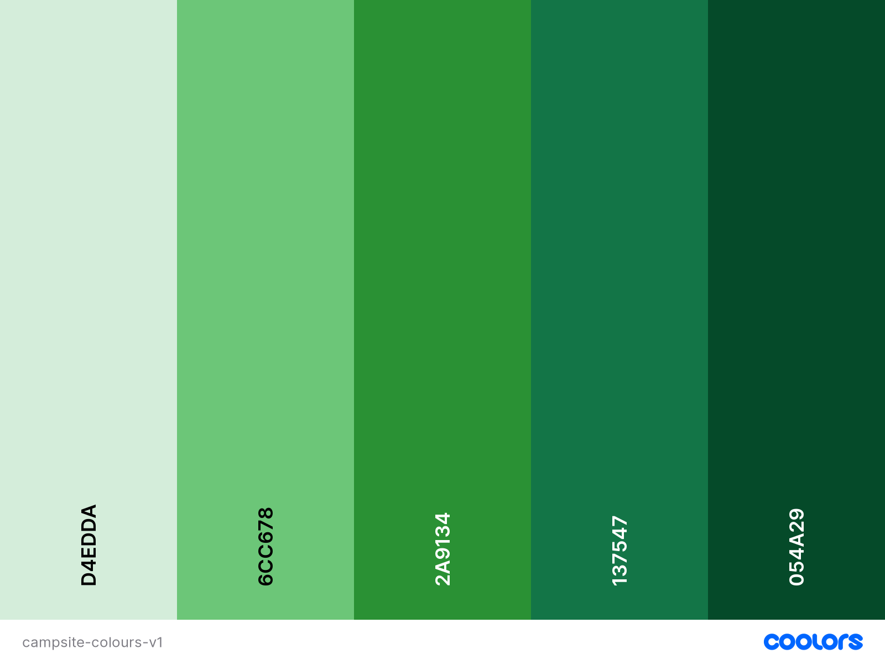

### Typography
The Sedan font was chosen from the Google Fonts library because it evoked feelings of a professional but fun business.

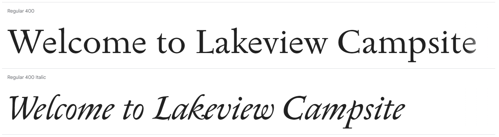

```
.sedan-regular {
  font-family: "Sedan", serif;
  font-weight: 400;
  font-style: normal;
}

.sedan-regular-italic {
  font-family: "Sedan", serif;
  font-weight: 400;
  font-style: italic;
}
```

### Imagery
Images were chosen that show an attractive campsite and surroundings. Bright images showing tents near a lake and tabled areas for rent for larger groups were selected to give a sense of an inclusive type of campsite. Images of people helping each other set up a tent were used for the "helpful staff" part of the information page.

### Wireframes
Wireframes were created in Balsamiq for the initial front-end design of the website. The mobile layout was designed first and the tablet and desktop were adapted from this.

**Home Page**
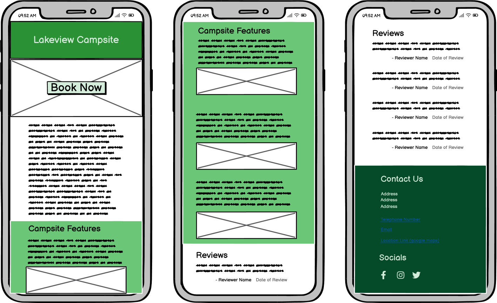

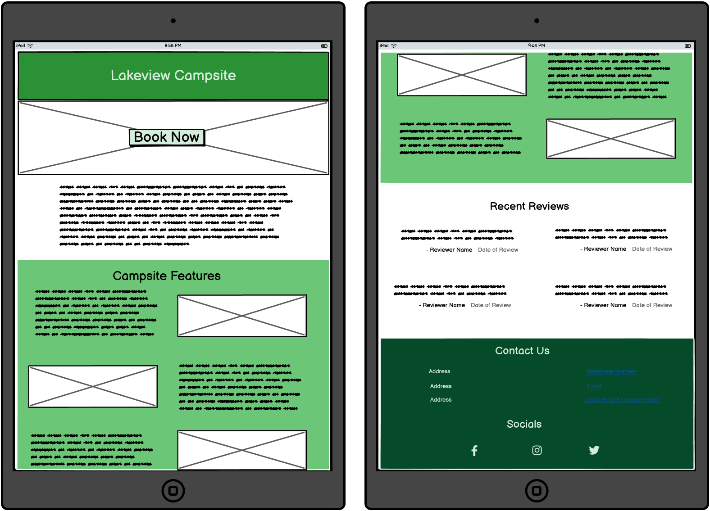

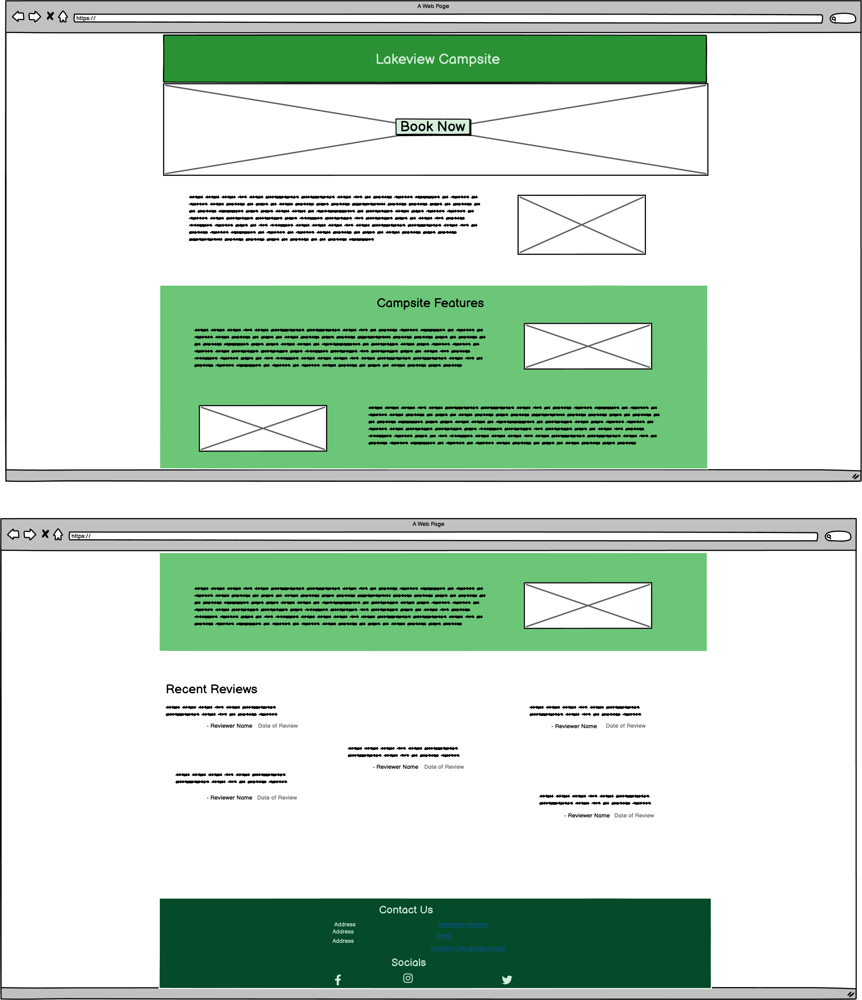


**Booking Page**
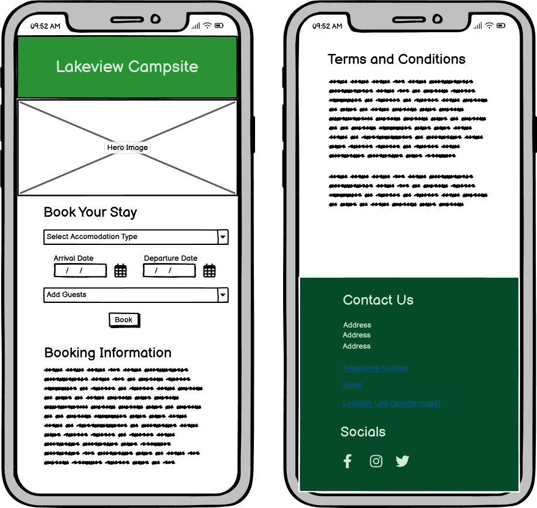

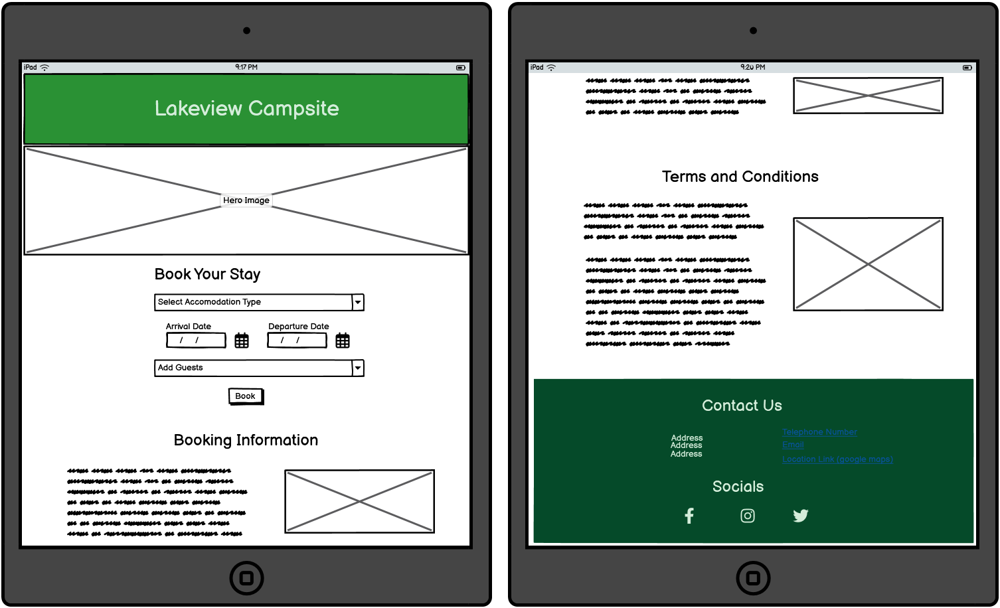

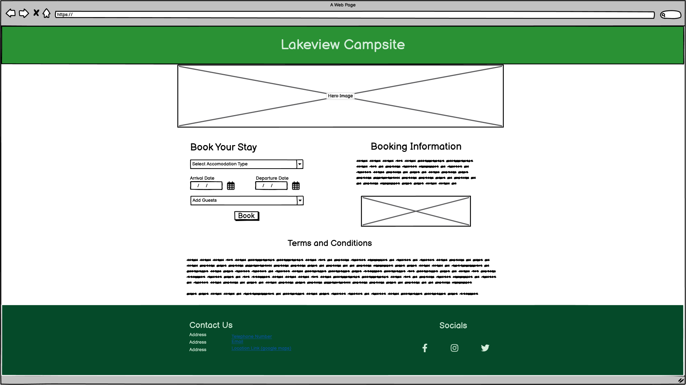

**Reviews Page**
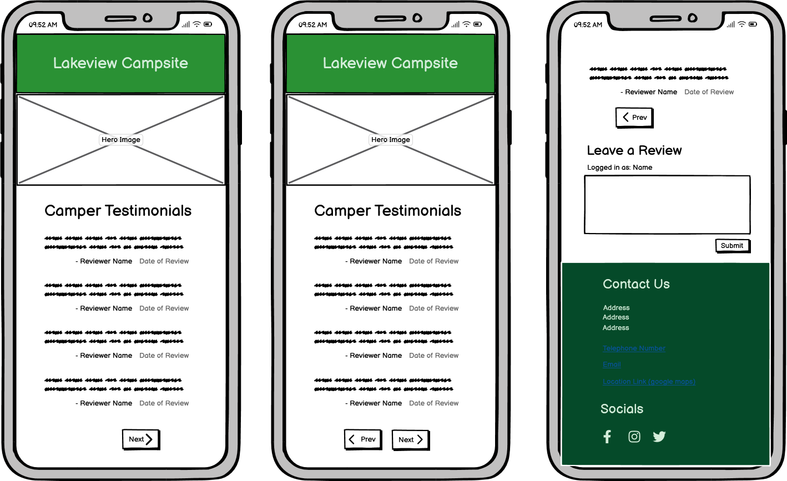

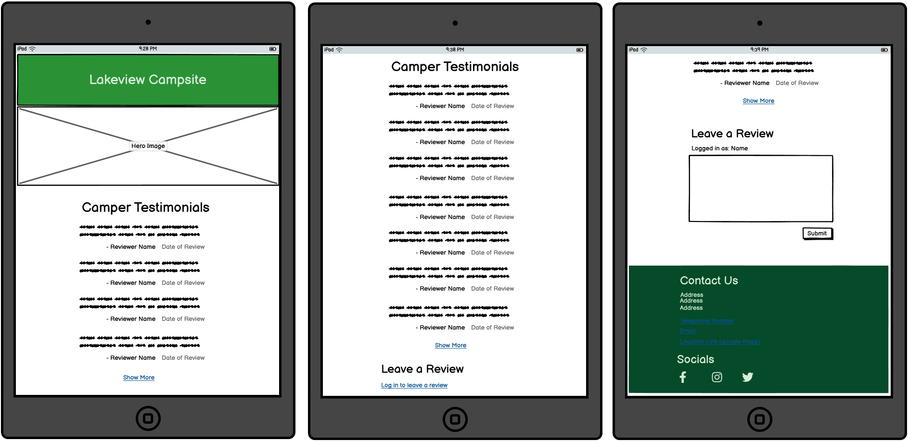

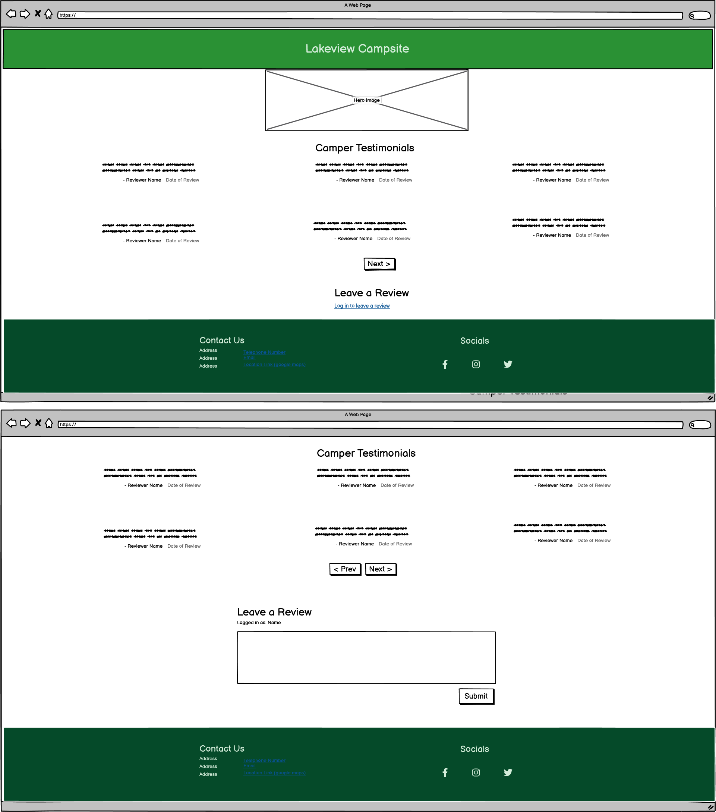

### Entity Relationship Diagrams

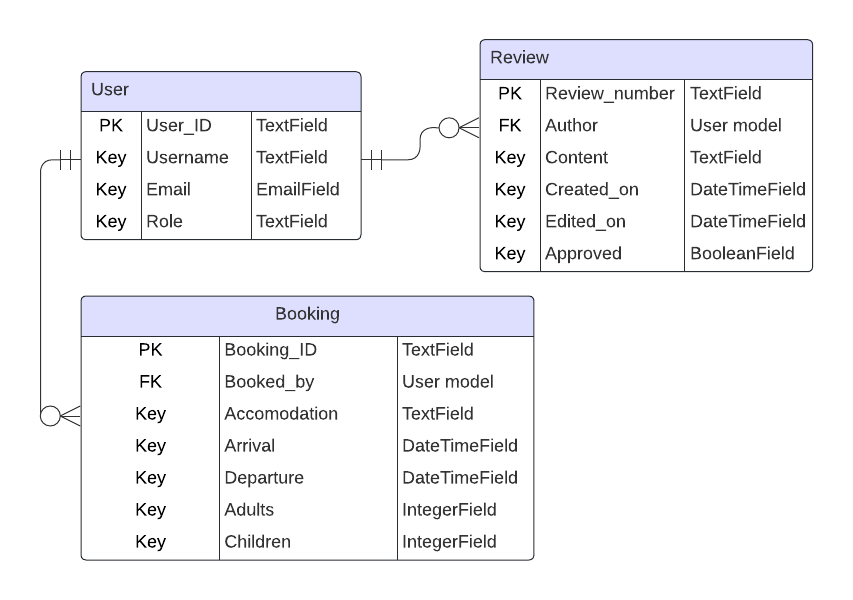

## Features
The website was designed to be as simple as possible, with little to no distracting content. A mobile-first design process was undertaken from the start.
The website is comprised of three pages visible to the site user: a homepage, booking page, and a reviews page. An admin page is also visible to superusers once logged in.

**All pages on the website have:**
* A favicon of a tent next to a tree with a cloud.

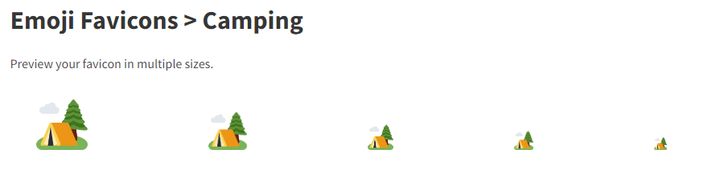

* A header with a title and nav bar or menu dropdown for page links


* A footer with contact information and social media links


## Responsiveness
On small screen sizes, namely mobiles, the website is displayed with content in a scrollable single column. This design was chosen as it is a comfortable and familiar experience for mobile users.

On tablet-sized screens, content is display in multiple columns to make user of the larger space. Reviews are now displayed four at a time with the use of previous and next buttons to view the paginated list.

On large screen sizes, multiple columns are again used, with empty space on the outermost columns to focus the user's attention in the middle of the page. This is more aesthetically pleasing than having content spread aross a wide screen.

## CRUD Functionality
A key requirement for this project was for users to be able to create, read, update, and/or delete data from the database as appropriate. User could interact with the database in these ways as follows:

### Create
* Site users and admin users may **create** by creating an account.
* Site users may **create** by creating a booking.
* Site users may **create** by posting reviews on the website after their stay.
* Admin users may **create** by writing responses to reviews.
* Admin users may **create** by adding information about the campsite to the homepage

### Read
* Site users and admin users may **read** by viewing the camping information page and reviews page.
* Site users may **read** by viewing their list of bookings.
* Admin user may **read** by viewing the list of all bookings.

### Update
* Site users may **update** by editing their account details.
* Site users may **update** by amending their booking information.
* Admin user may **update** by amending the camping information page and adding new photos.

### Delete
* Site users may **delete** by deleting their account.
* Site users may **delete** by cancelling their booking.
* Site users may **delete** by removing their reviews if desired.
* Admin users may **delete** by removing information, photos, or reviews.

### Admin View
The bookings are displayed with more details for the admin user without the use of a dropdown.
The wording changes on the booking page when the admin user edits something.

### Features to be Implemented

## Technologies Used
### Languages
HTML,
CSS,
Python,
Javascript,
and Django.

Relational database: PostgreSQL.


### Frameworks, Libraries, and Programs
Visual Studio Code and [Gitpod](https://www.gitpod.io/) - The IDEs used to write my code.

[Git](https://git-scm.com/) - For version control.

[GitHub](https://github.com/) - To save and store files online.

[W3Schools.com](https://www.w3schools.com/) and [The Python Library](https://docs.python.org/3/library/) - For researching and learning about Python methods and syntax.

[ScreenToGif](https://www.screentogif.com/) - To create gif files for this README.

Adobe Photoshop 2020 - To pixellate and crop some README images.

[Heroku](https://www.heroku.com/) - To host the deployed version of the program.

[Shields.io](https://shields.io/) - To add badges to this README.

[CI Python Linter](https://pep8ci.herokuapp.com/#) - To ensure code meets minimum PEP8 standards.

### Dependencies

## Deployment
The program was deployed on Heroku to allow the CI assessor and other interested parties to view and interact with the program.

### Local Deployment
To deploy this program locally on your device, please follow the steps below:

#### Forking
1. Log in or sign up to GitHub.
2. Navigate to the repository for [Scout Waiting List](https://github.com/simonhw/campsite-bookings).
3. Click the Fork button located in the top right part of the webpage.

#### Cloning
1. Log in or sign up to GitHub.
2. Navigate to the repository for [Scout Waiting List](https://github.com/simonhw/campsite-bookings).
3. Click on the green Code button, select your preferred option of HTTPS, SSH, or GitHub CLI, and copy the relevant link.
4. Open the terminal in your IDE and navigate to your directory of choice for this new clone.
5. Type `git clone` into the terminal and paste in your copied link. Press enter.

### Live Deployment

#### Heroku

## Testing
All documentation on the testing of this application can be found in the [TESTING.md](/TESTING.md) file.

## Credits

### Content
Some text content for this fictional website was generate using ChatGPT.
https://chatgpt.com/share/aa45f534-dbd4-484e-a73b-31742d06ca5c
### Media

https://www.pexels.com/photo/camping-chair-near-table-on-river-shore-6271625/
https://www.pexels.com/photo/camping-chairs-and-tent-near-calm-lake-6271654/
https://www.pexels.com/photo/tent-and-portable-chair-on-river-shore-in-summer-6271612/
https://www.pexels.com/photo/brown-wooden-table-under-a-tent-4994126/
https://www.pexels.com/photo/cheerful-traveling-couple-with-tent-near-lake-6271557/
https://www.pexels.com/photo/white-tents-in-the-middle-of-the-woods-4993954/
https://www.pexels.com/photo/tent-on-roof-of-car-on-lakeside-6271725/
https://www.pexels.com/photo/thermos-books-and-photo-camera-on-camp-tent-6271651/
https://www.pexels.com/photo/tent-and-camping-chair-on-river-shore-in-summer-6271619/
https://www.pexels.com/photo/man-in-green-sweater-lost-in-forest-using-smartphone-10374361/
https://www.pexels.com/photo/close-up-photo-of-chain-link-fence-3605822/

### Code Used
**All code in this project was written entirely by Simon Henleywillis unless otherwise specified below.**
form cleaning 
https://docs.djangoproject.com/en/5.0/ref/forms/validation/#cleaning-and-validating-fields-that-depend-on-each-other 

login/logout redirect
https://stackoverflow.com/questions/806835/django-redirect-to-previous-page-after-login

securing my-bookings/ against non-login users
https://stackoverflow.com/questions/24619629/django-do-not-allow-users-to-see-pages-when-they-are-not-logged-in

editing a django form
https://www.pythontutorial.net/django-tutorial/django-edit-form/ 

solving departure date bug
https://stackoverflow.com/questions/563406/how-to-add-days-to-date 

check superuser for view
https://stackoverflow.com/questions/12003736/django-login-required-decorator-for-a-superuser 

## Acknowledgements
- [Creating Your First README - Kera Cudmore](https://github.com/kera-cudmore/readme-examples)