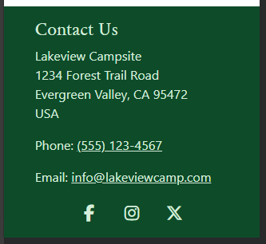
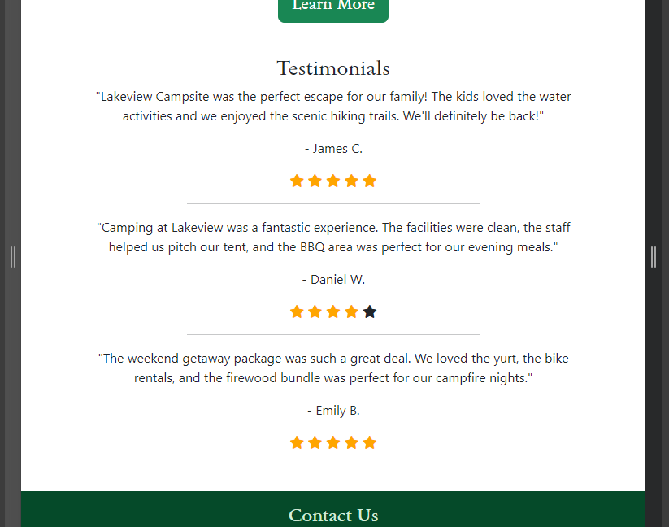
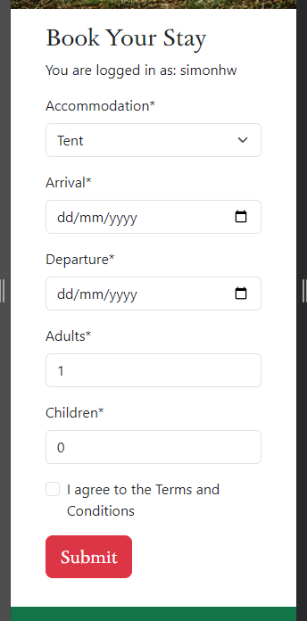
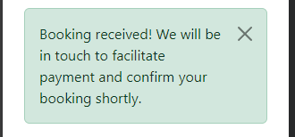
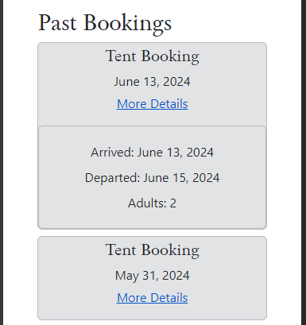
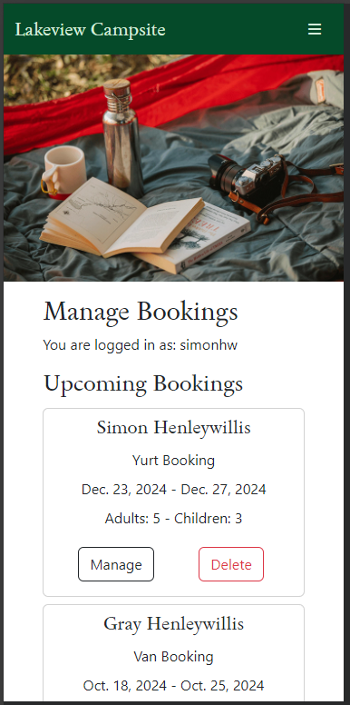

# Lakeview Campsite

This responsive website is designed to be viewed on a variety of screen sizes. Its purpose is to allow a visiting user to view information about and make a booking to stay at a campsite, and to allow an administrator to view all bookings and related information.

Deployed program on Heroku: [Lakeview Campsite](https://lakeview-campsite-8b683b53a1cd.herokuapp.com/)


## Contents
- [User Experience](#user-experience)
    - [Initial Discussion](#initial-discussion)
    - [Agile Planning](#project-planning-with-the-agile-approach)
    - [User Stories](#user-stories)
    - [Kanban Board](#kanban-board)
- [Design](#design)
    - [Colour Scheme](#colour-scheme)
    - [Typography](#typography)
    - [Imagery](#imagery)
    - [Wireframes](#wireframes)
    - [ERDs](#entity-relationship-diagrams)
    - [CRUD Functionality](#crud-functionality)
    - [Responsiveness](#responsiveness)
- [Features](#features)
    - [The Homepage](#the-homepage)
    - [The About Page](#the-about-page)
    - [Accounts Pages](#the-signup-page)
    - [The Booking Page](#the-booking-page)
    - [User Bookings](#user-bookings)
    - [Managing Bookings](#managing-bookings)
    - [Error Pages](#error-pages)
    - [Features to be Implemented](#features-to-be-implemented)
- [Technologies Used](#technologies-used)
    - [Languages](#languages)
    - [Frameworks, Libraries, and Programs](#frameworks-libraries-and-programs)
    - [Dependencies](#dependencies)
- [Deployment](#deployment)
    - [Local Deployment](#local-deployment)
    - [Live Deployment](#live-deployment)
- [Testing](#testing)
- [Credits](#credits)
    - [Media](#media)
    - [Code Used](#code-used)
- [Acknowledgements](#acknowledgements)


## User Experience
### Initial Discussion
The Lakeview Campsite website facilitates bookings for small and large groups for one night or more of camping. The goal of the site is to encourage business by showcasing the campsite information and offering a user-friendly booking system to users. The website allows staff users to manage all bookings.

### Project Planning with the Agile Approach
The Lakeview Campsite project was built using the Agile method. This involves breaking projects down into smaller manageable sections which allows team to deliver continuous working releases to the client and end users. These release periods are known as sprints and this project had four sprints over nine weeks.

User Stories were generated and grouped under different Epics to effectively structure the work involved at different stages of the project. These Epics were:
- "Initial Project Setup"
- "Create Models"
- "User Accounts"
- "Bookings System"
- "Website Content"
- "Bugs"
- "Documentation"

Each user story was assigned a number of labels to aid in the project workflow. These include:

- `Sprint 1/2/3/4` - To denote in which sprint the user story will be worked on.
- `Story Points: 1/2/3/5/8` - To denote how much effort each user story requires.
- `Must-Have` - A user story relating to a feature without which the website will not function correctly.
- `Should-Have` - A user story relating to a feature that will complement the core website features and enhance the user experience.
- `Could-Have` - A user story relating to a feature which would be of benefit to the user but without which the site will still achieve all its design goals.
- `Site User` - A user story from the perspective of a regular site user.
- `Site Admin` - A user story from the perspective of a site administrator.

Using the Agile method allowed this project to be managed well in small chunks. The developer was able to work on specific tasks without losing focus and manage and project the time required for these tasks optimally.

### User Stories

### Kanban Board

## Design
### Colour Scheme
A palette of green colours was chosen to reflect the calming and relaxing environment of the campsite, being surround by greenery and nature away from the hustle and bustle of the cities.


### Typography
The Sedan font was chosen from the Google Fonts library because it evoked feelings of a professional but fun business.


### Imagery
Images were chosen that show an attractive campsite and surroundings. Bright images showing tents near a lake and other forms of accommodation were selected to give a sense of an inclusive type of campsite. Images of people helping each other set up a tent were used for the "Need a Hand?" part of the About page. A beautiful drone/helicopter shot of a lake shore with a green landscape and mountains in the background was used in the index and About page to entice site users wishing to escape into nature for a relaxing holiday. 

The header image for smaller screens was either a tent and chair by the lake's edge or a closeup of books, a mug, and flask, and a camera on the floor of a tent. The latter was used mainly for account pages and the Manage Bookings page to reflect their administrative nature. A wider image of the chair and tent was used for larger screens to make good use of the extra horizontal space.

For the 404, 403, and 500 error pages, two different images were used. For the 403 page an image of a diamond mesh fence was used to convey the sense of forbidden access. For the 404 and 500 error pages, an image of a worried man looking at his phone in the woods was used, to give the sense of being lost or something having gone wrong.

### Wireframes
Wireframes were created in Balsamiq for the initial front-end design of the website. The mobile layout was designed first and the tablet and desktop were adapted from this.

**Home Page**


**Booking Page**


**Reviews Page**


### Entity Relationship Diagrams
An ERD was created to plan out the models that would be created and used in this project.


The User model shown above is the default model supplied with the Django framework, and is included to show how it related to the custom Booking model. Another custom Review model was planned but did not make it into this interation of the project. Further details on this model can be found in the [Features to be Implemented](#features-to-be-implemented) section.

### CRUD Functionality
A key requirement for this project was for users to be able to create, read, update, and/or delete data from the database as appropriate. User could interact with the database in these ways as follows:

#### Create
* Site users and admin users may **create** by creating an account.
* Site users may **create** by creating a booking.

#### Read
* Site users and admin users may **read** by viewing the home and about pages.
* Site users may **read** by viewing their list of bookings.
* Admin user may **read** by viewing the list of all bookings.

#### Update
* Site users may **update** by amending their booking information.
* Admin user may **update** by amending customer's booking information.

#### Delete
* Site users may **delete** by cancelling their booking.
* Admin users may **delete** by cancelling user bookings.

### Responsiveness
On small screen sizes, namely mobiles, the website is displayed with content in a scrollable single column. This design was chosen as it is a comfortable and familiar experience for mobile users.

On tablet-sized screens, content is display in multiple columns to make user of the larger space. Reviews are now displayed four at a time with the use of previous and next buttons to view the paginated list.

On large screen sizes, multiple columns are again used, with empty space on the outermost columns to focus the user's attention in the middle of the page. This is more aesthetically pleasing than having content spread aross a wide screen.

## Features
The website was designed to be as simple as possible, with little to no distracting content. A mobile-first design process was undertaken from the start.
The website is comprised of four main pages visible to the site user: a homepage, an about page, a booking form page, and a "my bookings" page (when logged in). An additional page is also visible to staff users once logged in where they can manage all bookings. Other pages visible to users include: the signup page, login page, logout page, password reset page, 404 error page, 403 error page, and 500 error page.

**All pages on the website have:**
1. A favicon of a tent next to a tree with a cloud.

    

2. A header with a title and nav bar or menu dropdown for page links

    

    

    The header contains links to the main pages of the website, depending on the login status of the site user. 
    - The website title "Lakeview Campsite" is a link which when clicked will return the user to the `index.html` page.
    - "About" brings the user to the `about.html` page.
    - "Book Now" brings the user to the `bookings.html` page.
    - "Log In" and "Sign Up" will direct the user to the respective account pages of `login.html` and `signup.html`.
    
    When a user is signed in, the header links change.
    - A new link "My Bookings" brings the user to the `user_bookings.html` page.
    - "Log In" and "Sign Up" are hidden and "Log Out" is shown, which will direct the user to the `logout.html` account page.

        

        

    When a user with staff status is logged in, instead of "My Bookings", a link titled "Manage Bookings" is shown which brings the user to the `manage_bookings.html` page.
    <br>

3. A footer with contact information and social media links

    

### The Homepage
The landing page for Lakeview campsite is brightly coloured yet minimalist. The user is immediately presented with a red call-to-action button encouraging them to book a stay. This is presented first as it is the main purpose of the website and also allows a returning user to quickly navigate to the booking page. The colour of the button was chosen as it matches well with the red fabric of the tent in the header image, thus giving the site a very slick and professional feel.


A short introduction to the user is then presented with an enticing image of a lakeside scene intended to excite the site user and make them want to find out more about the campsite.
Below this image is presented a green "Learn More" button which bring the the user to the comprehensively detailed about page. The green colour was chosen as it was more calm and neutral compared to the red previously used.


At the bottom of the homepage are some recent testimonials from former customers. This content is shown here to contribute to the main purpose of the landing page: encouraging users to make a booking. Three testimonials are listed to give a sense of a fair amount of reviews without detracting from the minimalist style of the page. The use of a star rating allows the site user to quickly understand the satisfaction of these previous customers after staying at Lakeview Campsite.



### The About Page
A different header image is used on this page for smaller screens, mainly to introduce some variety into its design. An image of a camp chair with a small table and flasks was chosen as it makes the site user feel relaxed and places them at the campsite in their mind's eye.
Below the header image, some extra details are given about the campsite with the same picturesque aerial image of the lake and mountains underneath.


The next section presents details on the location of Lakeview Campsite and how to get there from different points. Information for drivers and those using public transport is provided, giving the site user a sense of good accessibilty. Below this content, the red "Book Now" button is presented again to encourage the user to make a booking.


Next is the accommodation section. This is a short section that has a main purpose of showing imagery of the various types of accommodation on offer at the campsite. A carousel of images is used to show all four accommodation types without making the section feel too image-heavy. The images chosen are bright and full of welcoming colours to elicit a positive response from the site user.
The paragraph below informs the user that staff will be on hand to assist customers should they require it. This reassures the site user that guests with all levels of camping experience are welcome at Lakeview Campsite.


Sections listing the amenities and activities on offer are presented next, with a short description of each item. A green "New" badge is used next to one list item to show the user that the campsite is being actively maintained and improved for guests. This should reassure the site user that Lakeview Campsite is a professional and active business with something on offer for every type of customer.


The final section on this page is the pricing guide. This section breaks down the costs for each type of stay and activity, including extra services and package deals. The type of accomodation or package deal is presented in bold text which allows the user to quickly find the information most relevant to them. Green "New" badges are again utilised in this section to satisfy the user that the owners of Lakeview Campsite are always improving the business and that they would receive a high standard of service and care if they choose to book a stay.


A final "Book Now" call-to-action button is presented to the user again to avoid them having to scroll back up to the top of the page if they have now decided to make a booking.

### The Signup Page
New users that wish to make a booking must create an account to access this feature on the website. The user is brought to the `signup.html` page through either the [nav bar link](static/images/readme/header-nav.png) or the [booking page link](static/images/readme/booking-form-hidden.png).


This is a default Django signup form that is provided with the framework; however the template was amended to have a consistent style with the rest of the website and extend the custom `base.html` page.

Upon successful account creation, a message is shown to the user confirming the action and they are returned to the prevoius page they were viewing.


### The Sign In Page
The sign in page similary is a default Django form that has had its template styled to be consistent with the website. When returning users sign in successfully, they are shown a message to confirm their action and they are returned to the prevoius page they were viewing. There is also a reset password link on this page which is further discussed below.


#### The Password Reset Page
This page is included as standard with the Django framework, but in this release the email functionality is not fully implemented. See [Features to be Implemented](#features-to-be-implemented) for more disscusion on future plans. Regardless, the template was styled to be consistent with the rest of the site, as it is still accessible by the user. The "Reset My Password" button was disabled for final release to prevent the user from seeing a 500 error page and wondering if their password was reset or not.


### The Sign Out Page
When users click the sign out button in the nav bar they are directed to the `signout.html` page. Users must confirm the action by clicking the red "Sign Out" button after which they are redirected to the homepage. This is different from the previous two pages due to the fact that the user could be signing out from a page that required specific authenitcated access. Instead of showing the user a 403 error page, it was deemed a much better user experience to simply be returned to the homepage.


### The Booking Page
Unauthenticated users navigating to the booking page will not see the form until they either sign up or log in. Initially this functionality was achieved by having the Submit button be disabled for such users, but the rest of the form could still be interacted with, and upon signing in the user would have to enter their data again. This was deemed to be too poor a user experience so instead the entire form is only rendered when the user is logged in.


The authenticated user's username is displayed under the page's heading as a visual indication that they are logged in and to show under which account they are going to make a booking.



#### Form Fields
- Accommodation
    - A dropdown list of four types of accommodation is presented to the user for selection
        
        
        
- Arrival and Departure
    - The user can manually enter dates in these fields according to the format shown, or they can click the calendar icon to open a date picker. The earliest date possible for the arrival field is always tommorrow.

        
    
    - The minimum value for the depature date will always be the arrival date plus one day. This was achieved using custom JavaScript code explained futher below.

        
        
        

- Number of Guests
    - The final form fields are those for the number of adults and children in the booking. These fields only accept non-negative integers; the adults field has a minimum value of one and the children field has a minimum value of zero. The maximum number of guests of either type is set to 10, to prevent the user booking in impossibly large guest numbers. See [Features to be Implemented](#features-to-be-implemented) for more on this.

#### Form Validation
Validating the data to be submitted by the user is done both on the back and front end. 
- Accommodation
    - The dropdown list of four accommodation types is pre-selected to "Tent" and it is impossible to unselect any option in the list. This value is set in the `models.py` file.

        

        ```
        accommodation = models.IntegerField(choices=ACCOMMODATION, default=0)
        ```

- Arrival and Departure
    - The minimum values of the arrival and departure dates are set in the `forms.py` file:
        
        ```
        widgets = {
            'arrival': DateInput(attrs={
                'type': 'date',
                'id': 'arrival',
                'min': date.today() + timedelta(days=1)
                }),
            'departure': DateInput(attrs={
                'type': 'date',
                'id': 'departure',
                'min': date.today() + timedelta(days=2)
                }),
        }
        ```

        They are set such that the minimum value of arrival is always tomorrow from the point of view of the user, and the departure date is always at least the day after tomorrow.
        In most cases the arrival date will be selected first, so the minimum departure must be updated dynamically. this was achieved using [custom JavaScript code](static/js/booking.js). The custom code adds an event listener to the arrival input field and when the value is changed, set the new minimum departure date to be one day after the chosen arrival date.
        
        In cases where the user has selected a departure date and then updates the arrival date to be equal to are after the departure, the form is prevented from being submitted and the user is informed of their error.

        
        

- Number of Guests
    - If user attempt to submit the form with values less than the minimum or greater than the maximum values for the adults and children fields, the form does not submit and the user is informed of their error.

        
        

        

        These limits are set in `booking/models.py` using Django core validator classes as shown below:

        ```
            adults = models.PositiveIntegerField(default=1, validators=[MinValueValidator(1), MaxValueValidator(10)])
            children = models.PositiveIntegerField(default=0, validators=[MaxValueValidator(10)])
        ```

#### Form Submission
Upon valid data entry and submission, the data is POSTED to the database and a confirmation message is displayed to the user at the top of the page.



After submission, the input data is cleared and the form is restored to its default state.

#### Booking Information 
Below the form section, with a distinct white-on-green style to distinguish it from the booking form, the main points of informtion for making a booking are presented to the site user. These items are shown here to address the more frequently asked questions about bookings: check-in time, payments, and cancellations. The contact details for the campsite are listed here and the user is encouraged to get in touch regarding and special request or specific questions.


#### Terms and Conditions
A Bootstrap collapse component is utilised for the long list of Terms and Conditions to keep the booking page looking neat and avoid having to scroll too much to view the footer details. The user can choose to view the full list by clicking on the link as prompted.


### User Bookings
As described above, a given logged in user who is not a staff member may navigate to the `user_bookings.html` page and view a list of campsite booking make by them.


The bookings are separated into two sections: "My Bookings" and "Past Bookings". Bookings with a departure date of today or later are displayed in the former section and those whose departure date have passed are shown in the latter. All booking have a collapse link that allows the user to view more details when clicked. 


The details show all details that the user would have entered when making a booking: arrival date, departure date, and number of guests. When no children were booked in, this field is omitted entirely from the card.

#### Editing Bookings
The user is able to edit or delete bookings up until two day before the arrival date. When the edit button is clicked, the user is brought back to the booking form page. Through the use of template tags, the page checks if a booking id exists. In this case it does as the user has clicked on the "Edit" button, calling the `booking_edit` view which populates the form with the correct data. The heading is thus changed to read "Edit Your Stay" and the submit button text changed to "Update". This is a way of making sure the user is aware that they are editing an existing booking as opposed to making a new one.


If the new data is valid, the user is shown a message confirming their action and is redirected to the `user_bookings.html` page.


If the booking arrival date is within the next 48 hours, the user is not able to amend the details and a modal message is displayed informing the user of same and prompting them to get in contact with the campsite staff. A modal was chosen for this feature as it forces the user to acknowledge the message and click a button labelled "Understood" before they are able to interact with the website again. The campsite contact phone number is linked here for the user's convenience.


This is achieved by writing a custom method in `booking/models.py` which returns a boolean value based on whether the date provided is within the next 48 hours. This method can be easily amended to restrict to any number of hours or days using the `timedelta` class.
```
def is_within_48h(self):
    return self.arrival < date.today() + timedelta(hours=48)
```

#### Deleting Bookings
Similar to above, the user can choose to delete their booking as long as it is not within the next 48 hours. A modal is shown to the user asking them to confirm this action and reminds them that it is not possible to retrieve the data afterwards.


If the booking is successfully deleted, the user is shown a message confirming the action and is redirected to their bookings page.


As with the edit action described above, if the booking is in the next 48 hours another [modal](static/images/readme/delete-denied.png) is shown to the user explaining that it is not possible to delete the booking and action does not take place.

#### Past Bookings
A list of past booking is also shown to the user on this page for ease of reference. When the "More Details" link is clicked, the details for the chosen past booking are displayed. The wording here is slightly different with the past tense of "Arrived" and "Departed" used. No edit or delete functionality is possible with these bookings.



#### No Bookings
If the user has no bookings associated with their account, paragraphs are displayed to this effect.


### Managing Bookings
For a staff user, all bookings can be managed by navigating to the `manage_bookings.html` page. Here a list of all bookings is displayed, with the booking card having a slightly different format to that seen in the `user_bookings.html` page. Each booking card has the user's name or username displayed at the top and all relevant booking details are listed below it. The same options of editing and deleting bookings are afforded to the staff user here, but the wording is changed from "Edit" to "Manage". There is currently no functionality implemented for a user to edit their account details and add their first and last names; when this is the case, their username is displayed on the card instead of their first and last name. The staff user is also not limited when choosing to manage or delete a booking that is within 48 hours.




### Error Pages

### Features to be Implemented
- occupancy limits per accom type
- images on booking page per type
- add pricing information and page
- upgrade calendar to booking style with available dates
- diasble the form not just the submit button when not signed in
- sort bookings by month for the admin user
- have to accept terms and conditions to submit booking
- modal to contact us if wanted to book >10 guests
- set guests limits based on accommodation type selected.
- replace toast messages with modals
- robins tips
- email funtionality
- signout page extra button
- include more details such as price and packages in my bookings details

## Technologies Used
### Languages
HTML,
CSS,
Python,
and Javascript

Relational database: PostgreSQL.


### Frameworks, Libraries, and Programs
[Django](https://www.djangoproject.com/) - A Python framework used to design the website.

Visual Studio Code and [Gitpod](https://www.gitpod.io/) - The IDEs used to write my code.

[Git](https://git-scm.com/) - For version control.

[GitHub](https://github.com/) - To save and store files online.

[ElephantSQL](https://www.elephantsql.com/) - To create and store the database.

[LucidChart](https://lucid.app/) - To create Entity Relationship Diagrams

[Bootstrap](https://getbootstrap.com/) - To build and style content on the website.

[W3Schools.com](https://www.w3schools.com/) and [The Python Library](https://docs.python.org/3/library/) - For researching and learning about Python methods and syntax.

[ScreenToGif](https://www.screentogif.com/) - To create gif files for this README.

Adobe Photoshop 2020 - To pixellate and crop some README images.

[Heroku](https://www.heroku.com/) - To host the deployed version of the program.

[Shields.io](https://shields.io/) - To add badges to this README.

[CI Python Linter](https://pep8ci.herokuapp.com/#) - To ensure code meets minimum PEP8 standards.

### Dependencies

## Deployment
The program was deployed on Heroku to allow the CI assessor and other interested parties to view and interact with the program.

### Local Deployment
To deploy this program locally on your device, please follow the steps below:

#### Forking
1. Log in or sign up to GitHub.
2. Navigate to the repository for [Scout Waiting List](https://github.com/simonhw/campsite-bookings).
3. Click the Fork button located in the top right part of the webpage.

#### Cloning
1. Log in or sign up to GitHub.
2. Navigate to the repository for [Scout Waiting List](https://github.com/simonhw/campsite-bookings).
3. Click on the green Code button, select your preferred option of HTTPS, SSH, or GitHub CLI, and copy the relevant link.
4. Open the terminal in your IDE and navigate to your directory of choice for this new clone.
5. Type `git clone` into the terminal and paste in your copied link. Press enter.

### Live Deployment

#### Heroku

## Testing
All documentation on the testing of this application can be found in the [TESTING.md](/TESTING.md) file.

## Credits

### Content
Some text content for this fictional website was generate using ChatGPT.
https://chatgpt.com/share/aa45f534-dbd4-484e-a73b-31742d06ca5c
### Media

https://www.pexels.com/photo/camping-chair-near-table-on-river-shore-6271625/
https://www.pexels.com/photo/camping-chairs-and-tent-near-calm-lake-6271654/
https://www.pexels.com/photo/tent-and-portable-chair-on-river-shore-in-summer-6271612/
https://www.pexels.com/photo/brown-wooden-table-under-a-tent-4994126/
https://www.pexels.com/photo/cheerful-traveling-couple-with-tent-near-lake-6271557/
https://www.pexels.com/photo/white-tents-in-the-middle-of-the-woods-4993954/
https://www.pexels.com/photo/tent-on-roof-of-car-on-lakeside-6271725/
https://www.pexels.com/photo/thermos-books-and-photo-camera-on-camp-tent-6271651/
https://www.pexels.com/photo/tent-and-camping-chair-on-river-shore-in-summer-6271619/
https://www.pexels.com/photo/man-in-green-sweater-lost-in-forest-using-smartphone-10374361/
https://www.pexels.com/photo/close-up-photo-of-chain-link-fence-3605822/
https://www.pexels.com/photo/people-sitting-around-bonfire-during-nighttime-4994136/
https://www.pexels.com/photo/autumn-forest-over-lake-in-canada-20843515/
https://www.pexels.com/photo/person-sitting-on-grass-field-facing-on-body-of-water-2516423/
https://www.pexels.com/photo/a-luxurious-tent-on-a-campsite-in-a-forest-5364965/
https://www.pexels.com/photo/tent-on-lake-shore-against-lush-trees-6271631/
https://www.pexels.com/photo/white-and-gray-camper-trailer-7967392/
https://www.pexels.com/photo/chairs-outside-a-tent-6271635/
https://www.pexels.com/photo/lakeshore-and-village-on-plains-17891215/ 

### Code Used
**All code in this project was written entirely by Simon Henleywillis unless otherwise specified below.**
form cleaning 
https://docs.djangoproject.com/en/5.0/ref/forms/validation/#cleaning-and-validating-fields-that-depend-on-each-other 

login/logout redirect
https://stackoverflow.com/questions/806835/django-redirect-to-previous-page-after-login

securing my-bookings/ against non-login users
https://stackoverflow.com/questions/24619629/django-do-not-allow-users-to-see-pages-when-they-are-not-logged-in

editing a django form
https://www.pythontutorial.net/django-tutorial/django-edit-form/ 

solving departure date bug
https://stackoverflow.com/questions/563406/how-to-add-days-to-date 

check superuser for view
https://stackoverflow.com/questions/12003736/django-login-required-decorator-for-a-superuser 

star ratings
https://www.w3schools.com/howto/howto_css_star_rating.asp

## Acknowledgements
- [Creating Your First README - Kera Cudmore](https://github.com/kera-cudmore/readme-examples)
- Graeme
- Robin

## Mentor Meeting Notes
- linter
- w3c
- lighthouse
- extensive testing
- detailed explanation of features and reasons why
- update ERD