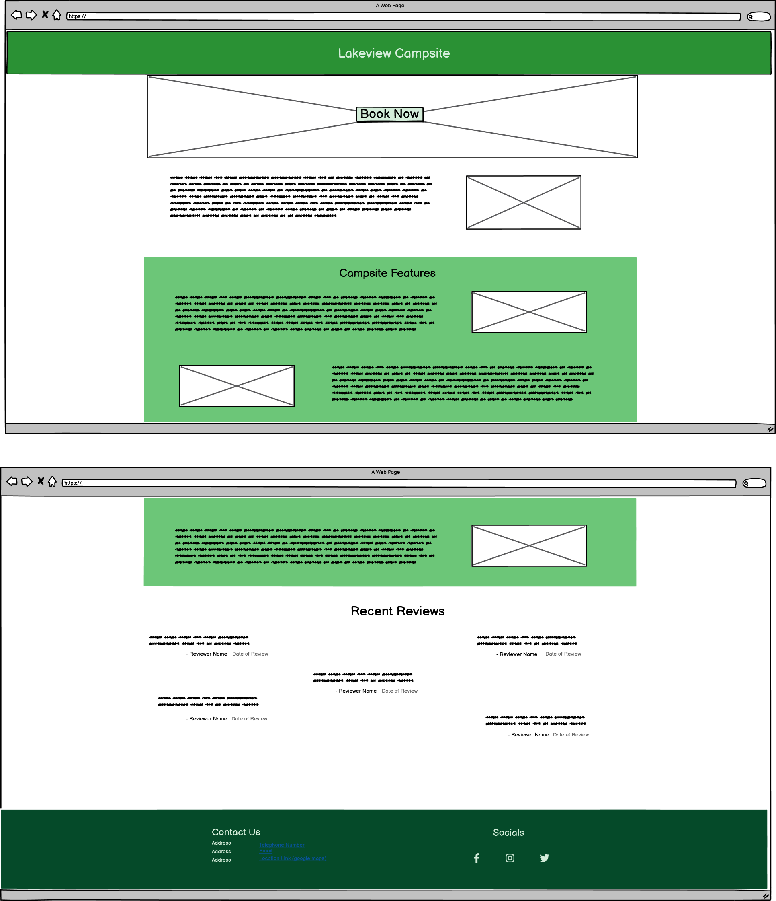
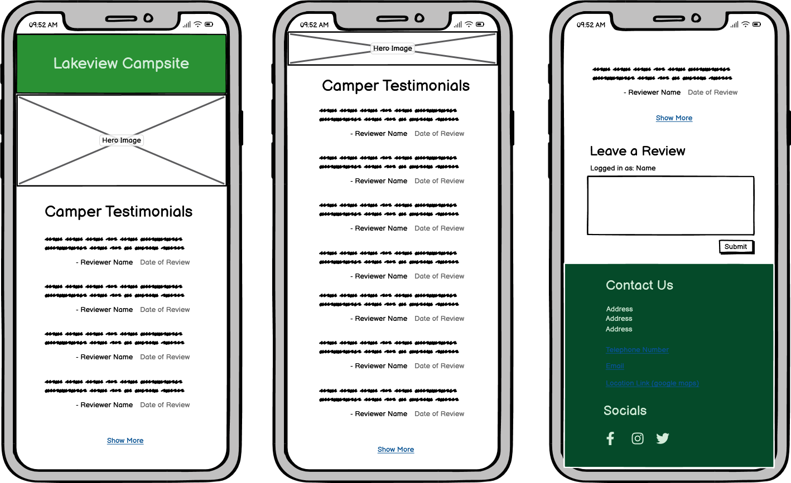
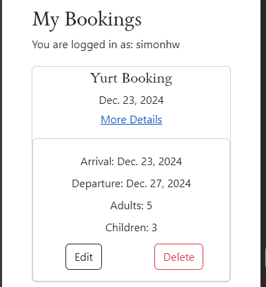

# Lakeview Campsite

This responsive website is designed to be viewed on a variety of screen sizes. Its purpose is to allow a visiting user to view information about and make a booking to stay at a campsite, and to allow an administrator to view all bookings and related information.


Deployed program on Heroku: [Lakeview Campsite](https://lakeview-campsite-8b683b53a1cd.herokuapp.com/)


## Contents
- [User Experience](#user-experience)
    - [Initial Discussion](#initial-discussion)
    - [Agile Planning](#project-planning-with-the-agile-approach)
    - [User Stories](#user-stories)
    - [Kanban Board](#kanban-board)
- [Design](#design)
    - [Colour Scheme](#colour-scheme)
    - [Typography](#typography)
    - [Imagery](#imagery)
    - [Wireframes](#wireframes)
    - [ERDs](#entity-relationship-diagrams)
    - [CRUD Functionality](#crud-functionality)
    - [Responsiveness](#responsiveness)
- [Features](#features)
    - [The Homepage](#the-homepage)
    - [The About Page](#the-about-page)
    - [Accounts Pages](#the-signup-page)
    - [The Booking Page](#the-booking-page)
    - [User Bookings](#user-bookings)
    - [Managing Bookings](#managing-bookings)
    - [Error Pages](#error-pages)
    - [Features to be Implemented](#features-to-be-implemented)
- [Technologies Used](#technologies-used)
    - [Languages](#languages)
    - [Frameworks, Libraries, and Programs](#frameworks-libraries-and-programs)
    - [Dependencies](#dependencies)
- [Deployment](#deployment)
    - [Local Deployment](#local-deployment)
    - [Live Deployment](#live-deployment)
- [Testing](#testing)
- [Credits](#credits)
    - [Content](#content)
    - [Media](#media)
    - [Code Used](#code-used)
- [Acknowledgements](#acknowledgements)


## User Experience
### Initial Discussion
The Lakeview Campsite website facilitates bookings for small and large groups for one night or more of camping. The goal of the site is to encourage business by showcasing the campsite information and offering a user-friendly booking system to users. The website allows staff users to manage all bookings.

### Project Planning with the Agile Approach
The Lakeview Campsite project was built using the Agile method. This involves breaking projects down into smaller manageable sections which allows teams to deliver continuous working releases to the client and end users. These release periods are known as sprints and this project had four sprints over nine weeks.

User Stories were generated and grouped under different Epics to effectively structure the work involved at different stages of the project. These Epics were:
- "Initial Project Setup"
- "Create Models"
- "User Accounts"
- "Bookings System"
- "Website Content"
- "Bugs"
- "Writing Documentation"

Each user story was assigned a number of labels to aid in the project workflow. These include:

- `Sprint 1/2/3/4` - To denote in which sprint the user story will be worked on.
- `Story Points: 1/2/3/5/8` - To denote how much effort each user story requires.
- `Must-Have` - A user story relating to a feature without which the website will not function correctly.
- `Should-Have` - A user story relating to a feature that will complement the core website features and enhance the user experience.
- `Could-Have` - A user story relating to a feature that be of benefit to the user but without which the site will still achieve all its design goals.
- `Site User` - A user story from the perspective of a regular site user.
- `Site Admin` - A user story from the perspective of a site administrator.
- `documentation` - A task related to writing the README or TESTING documents.
- `bug` - Denoting an unsolved bug.
- `Solved Bug` - Denoting a bug that has been resolved.

Using the Agile method allowed this project to be managed well in small chunks. The developer was able to work on specific tasks without losing focus and manage and project the time required for these tasks optimally.

### User Stories
#### Epic: Initial Project Setup
- **Set Up Django Files**: As a **Developer** I can **set up the Django template files** so that **I can begin to write code for the project**.
    - I can install the correct version of Django.
    - I can create a project called **lakeview**.
    - I can create an app called **home**.
    - I can display a "Hello world!" string on the webpage.

- **Create PostgreSQL Database**: As a **Developer** I can **create a could-based database** so that **store and retrieve data for my website**.
    - I can create a new PostgreSQL instance
    - I can copy the URL in the Details section
    - I can create the env.py file and set DATABASE_URL constant.
    - I can install the relevant packages for database connection.
    - I can run migrations.

- **Deploy Project to Heroku**: As a **Developer** I can **deploy the project to Heroku** so that **I can see that the website displays properly**.
    - I can create a Heroku app with a unique name.
    - I can update the code for deployment with gunicorn.
    - I can deploy the app on Heroku.

- **Deploy Heroku App with Static Files**: As a **Developer** I can **deploy the project with static files** so that **the app will have the same styling as the local version.**.
    - I can set up the WhiteNoise module.
    - I can add the relevant data to the settings file.
    - I can create a staticfiles directory and collect the static files.
    - I can deploy the project on Heroku and ensure all styles are applied.

#### Epic: Create Models
- **Create Bookings Model**: As a **Developer** I can **create a Django model** so that **a user can create a campsite booking**.
    - I can create a **booking** app.
    - I can create a models file.
    - I can declare the necessary imports.
    - I can create a model with the appropriate fields required.

- **Move Booking Model to the Correct App**: As a **Developer** I can **successfully migrate a model from one app to another** so that I can **have all the relevant code for a desired action contained in one app**.
    - I can create the new model in the correct app.
    - I can change all the references from old model to the new model in other files.
    - I can run migrations and check for any errors.
    - I can delete the old model once the Heroku app is verified to be working properly.

#### Epic: User Accounts
- **Create an Account**: As a **Site User** I can **create an account** so that **I can make bookings and leave reviews**.
    - When I click the sign-in button, I am prompted to make an account.
    - After registering my details, I can log in and view, create, update, or delete a booking.
    - I can log out and log back in using the password I created.

#### Epic: Website Content
- **Create Base Template**: As a **Developer** I can **create a base template and homepage** so that **the similar aspects of the webpages need only be written once and the UX has a consistent appearance across the app**.
    - I can create a base.html file.
    - I can create a header and nav bar for small screens.
    - I can create a footer for small screens.
    - I can create a header and nav bar for larger screens.
    - I can create a footer for larger screens.

- **View Campsite Information**: As a **Site User** I can **view information about the campsite** so that **I can make an informed decision about making a booking**.
    - When I visit the About page, I can read the campsite information.
    - I can view the location of the campsite.
    - I can view the size of the campsite.
    - I can view the facilities and services offered.

- **Create Error Pages**: As a **Developer** I can **create certain error pages** so that **a site user can understand when something goes wrong viewing a webpage**
    - I can create a 404 error page.
    - I can create a 403 error page.
    - I can create a 500 error page.

#### Epic: Bookings System
- **Make a Booking**: As a **Site User** I can **select a booking option** so that I can **secure a campsite booking**.
    - I can view the types of bookings that can be made.
    - I can select an option to book.
    - I can only select valid date options.
    

- **View My Bookings**: As a **Site User** I can **view my bookings** so that I can **see my bookings history as well as upcoming bookings**.
    - When I open the bookings page, I will see a list of my past and future bookings
    - When the booking is in the past, I will see it displayed in a different style to future bookings.
    - When I click on a booking, I will be able to view more detailed information about it.

- **Edit a Booking**: As a **Site User** I can **edit a booking of mine** so that I can **have control over the details of my bookings**.
    - I can select an upcoming booking to edit.
    - For a past booking, I do not have the option to edit the details.
    - When editing booking details, I can change any details they wish and save the changes.
    - If the booking is less than 48 hours away, I cannot edit the booking and I am instead prompted to ring the campsite for further instruction.

- **Delete a Booking**: As a **Site User** I can **cancel a booking** so that **I can manage my stay at the campsite**.
    - I can navigate to my bookings page and cancel a booking.
    - If the booking is less than 48 hours away, I will not have the option to cancel and will be prompted to ring the campsite for further advice.
    - Otherwise, a modal prompt will ask me to confirm this irreversible action.
    - On successful deletion, a confirmation message will be displayed to me.

- **View All Bookings**: As a **Site Admin** I can **view all bookings** so that **I can understand when people will use the campsite**.
    - I can view a list of all bookings and their details.
    - For a given booking, I can amend or delete it.
    - For a booking in the past, I cannot amend or delete it.

#### Epic: Bugs
- As a **Developer** I can **detail and keep track of bugs** so that I can **solve them before release or come up with a plan to address them in the future**.

#### Epic: Writing Documentation
- As a **Developer** I can **write a README and TESTING file** so that **others can learn about my app and see the work that has gone into preparing it for final release**.

### Kanban Board
The GitHub Projects tool was used to manage development progress for this website. The kanban board was used to separate tasks into four columns:
- Todo
- In Progress
- Done
- Future Features

The Epics and labels discussed above were used in conjunction with the board and allowed the developer to manage their time well during development. Below is a screenshot of the final state of the kanban board. The project can be viewed on the [GitHub Projects](https://github.com/users/simonhw/projects/3/) page.


## Design
### Colour Scheme
A palette of green colours was chosen to reflect the calming and relaxing environment of the campsite, being surrounded by greenery and nature away from the hustle and bustle of the cities.


### Typography
The Sedan font was chosen from the Google Fonts library because it evoked feelings of a professional but fun business.


### Imagery
Images were chosen that show an attractive campsite and surroundings. Bright images showing tents near a lake and other forms of accommodation were selected to give a sense of an inclusive type of campsite. Images of people helping each other set up a tent were used for the "Need a Hand?" part of the About page. A beautiful drone/helicopter shot of a lake shore with a green landscape and mountains in the background was used in the index and About page to entice site users wishing to escape into nature for a relaxing holiday. 

The header image for smaller screens was either a tent and chair by the lake's edge or a closeup of books, a mug, and flask, and a camera on the floor of a tent. The latter was used mainly for account pages and the Manage Bookings page to reflect their administrative nature. A wider image of the chair and tent was used for larger screens to make good use of the extra horizontal space.

For the 404, 403, and 500 error pages, two different images were used. For the 403 page, an image of a diamond mesh fence was used to convey the sense of forbidden access. For the 404 and 500 error pages, an image of a worried man looking at his phone in the woods was used, to give the sense of being lost or something having gone wrong.

### Wireframes
Wireframes were created in Balsamiq for the initial front-end design of the website. The mobile layout was designed first and the tablet and desktop were adapted from this.

**Home Page**





**Booking Page**


**Reviews Page**




### Entity Relationship Diagrams
An ERD was created to plan out the models that would be created and used in this project.


The User model shown above is the default model supplied with the Django framework and is included to show how it relates to the custom Booking model. Another custom Review model was planned but did not make it into this iteration of the project. Further details on this model can be found in the [Features to be Implemented](#features-to-be-implemented) section.

### CRUD Functionality
A key requirement for this project was for users to be able to create, read, update, and/or delete data from the database as appropriate. Users could interact with the database in these ways as follows:

#### Create
* Site users and admin users may **create** by creating an account.
* Site users may **create** by creating a booking.

#### Read
* Site users and admin users may **read** by viewing the home and about pages.
* Site users may **read** by viewing their list of bookings.
* Admin user may **read** by viewing the list of all bookings.

#### Update
* Site users may **update** by amending their booking information.
* Admin user may **update** by amending customers' booking information.

#### Delete
* Site users may **delete** by cancelling their booking.
* Admin users may **delete** by cancelling user bookings.

### Responsiveness
- On small screen sizes, namely mobiles, the website is displayed with content taking up most of the horizontal space, using a Bootstrap column width of 10 with an offset of 1. This allows for most of the screen to be utilised while still being visually appealing with a buffer of empty space on either side. Images used in the header were sized appropriately for the screen size to improve loading time. For larger screens, wider images were displayed while the smaller images were hidden. The navbar links are displayed in a dropdown menu typical of mobile websites which keeps the header looking neat and tidy on small screens.

    <details><summary>Comparison of nav bar on small and large screens</summary>

    

    

    </details>

    <details><summary>Comparison of content layout on small and large screens</summary>

    

    

    </details><br>

- On tablet-sized screens, the footer content is centre-aligned to be more visually appealing. The booking form and booking detail cards are displayed more neatly to the user at these screen sizes in a Bootstrap column of width 6 with an offset of 3.

    <details><summary>Comparison of footer on mobile and tablet screens</summary>

    

    

    </details>

    <details><summary>Comparison of booking form and cards on small and large screens</summary>

    

    

    

    

    </details><br>

- On large screen sizes, content is generally displayed in Bootstrap columns of width 6 with an offset of 3 to direct the user's attention to the middle of their screen and avoid using the extreme edges of these wider displays. The booking form and booking cards are displayed more tightly in Bootstrap columns of 4 with an offset of 4, as this content is by nature more narrow. The Sign Out page content is centre-aligned for medium-sized screens and up so that it looks visually appealing on larger screens.

    <details><summary>Booking cards on desktop screens</summary>

    

    </details>

    <details><summary>Comparison of Sign Out page on small and large screens</summary>

    
    

    </details>

## Features
The website was designed to be as simple as possible, with little to no distracting content. A mobile-first design process was undertaken from the start.
The website is comprised of four main pages visible to the site user: a homepage, an about page, a booking form page, and a "my bookings" page (when logged in). An additional page is also visible to staff users once logged in where they can manage all bookings. Other pages visible to users include the signup page, login page, logout page, password reset page, 404 error page, 403 error page, and 500 error page.

**All pages on the website have:**
1. A favicon of a tent next to a tree with a cloud.

    

2. A header with a title and nav bar or menu dropdown for page links

    

    

    The header contains links to the main pages of the website, depending on the login status of the site user. 
    - The website title "Lakeview Campsite" is a link which when clicked will return the user to the `index.html` page.
    - "About" brings the user to the `about.html` page.
    - "Book Now" brings the user to the `bookings.html` page.
    - "Log In" and "Sign Up" will direct the user to the respective account pages of `login.html` and `signup.html`.
    
    When a user is signed in, the header links change.
    - A new link "My Bookings" brings the user to the `user_bookings.html` page.
    - "Log In" and "Sign Up" are hidden and "Log Out" is shown, which will direct the user to the `logout.html` account page.

        

        

    When a user with staff status is logged in, instead of "My Bookings", a link titled "Manage Bookings" is shown which brings the user to the `manage_bookings.html` page.
    <br>

3. A footer with contact information and social media links

    

### The Homepage
The landing page for Lakeview Campsite is brightly coloured yet minimalist. The user is immediately presented with a red call-to-action button encouraging them to book a stay. This is presented first as it is the main purpose of the website and also allows a returning user to quickly navigate to the booking page. The colour of the button was chosen as it matches well with the red fabric of the tent in the header image, thus giving the site a very slick and professional feel.


A short introduction to the user is then presented with an enticing image of a lakeside scene intended to excite the site user and make them want to find out more about the campsite.
Below this image is presented a green "Learn More" button which brings the user to the comprehensively detailed About page. The green colour was chosen as it was more calm and neutral compared to the red previously used.


At the bottom of the homepage are some recent testimonials from former customers. This content is shown here to contribute to the main purpose of the landing page: encouraging users to make a booking. Three testimonials are listed to give a sense of a fair amount of reviews without detracting from the minimalist style of the page. The use of a star rating allows the site user to quickly understand the satisfaction of these previous customers after staying at Lakeview Campsite.


### The About Page
A different header image is used on this page for smaller screens, mainly to introduce some variety into its design. An image of a camp chair with a small table and flasks was chosen as it makes the site user feel relaxed and places them at the campsite in their mind's eye.
Below the header image, some extra details are given about the campsite with the same picturesque aerial image of the lake and mountains underneath.


The next section presents details on the location of Lakeview Campsite and how to get there from different points. Information for drivers and those using public transport is provided, giving the site user a sense of good accessibility. Below this content, the red "Book Now" button is presented again to encourage the user to make a booking.


Next is the accommodation section. This is a short section that has the main purpose of showing imagery of the various types of accommodation on offer at the campsite. A carousel of images is used to show all four accommodation types without making the section feel too image-heavy. The images chosen are bright and full of welcoming colours to elicit a positive response from the site user.
The paragraph below informs the user that staff will be on hand to assist customers should they require it. This reassures the site user that guests with all levels of camping experience are welcome at Lakeview Campsite.


Sections listing the amenities and activities on offer are presented next, with a short description of each item. A green "New" badge is used next to one list item to show the user that the campsite is being actively maintained and improved for guests. This should reassure the site user that Lakeview Campsite is a professional and active business with something on offer for every type of customer.


The final section on this page is the pricing guide. This section breaks down the costs for each type of stay and activity, including extra services and package deals. The type of accommodation or package deal is presented in bold text which allows the user to quickly find the information most relevant to them. Green "New" badges are again utilised in this section to satisfy the user that the owners of Lakeview Campsite are always improving the business and that they would receive a high standard of service and care if they choose to book a stay.


A final "Book Now" call-to-action button is presented to the user again to avoid them having to scroll back up to the top of the page if they have now decided to make a booking.

### The Signup Page
New users who wish to make a booking must create an account to access this feature on the website. The user is brought to the `signup.html` page through either the [nav bar link](static/images/readme/header-nav.png) or the [booking page link](static/images/readme/booking-form-hidden.png).


This is a default Django signup form that is provided with the framework; however, the template was amended to have a consistent style with the rest of the website and extend the custom `base.html` page.

Upon successful account creation, a message is shown to the user confirming the action and they are returned to the previous page they were viewing.


### The Sign In Page
The sign-in page similarly is a default Django form that has had its template styled to be consistent with the website. When returning users sign in successfully, they are shown a message to confirm their action and they are returned to the previous page they were viewing. There is also a reset password link on this page which is further discussed below.


### The Sign Out Page
When users click the sign-out button in the nav bar they are directed to the `signout.html` page. Users must confirm the action by clicking the red "Sign Out" button after which they are redirected to the homepage. This is different from the previous two pages because the user could be signing out from a page that required specific authenticated access. Instead of showing the user a 403 error page, it was deemed a much better user experience to simply be returned to the homepage. A "Cancel" button allows the user to navigate back to the previous page without having to use their browser.


### The Booking Page
Unauthenticated users navigating to the booking page will not see the form until they either sign up or log in. Initially, this functionality was achieved by having the Submit button be disabled for such users, but the rest of the form could still be interacted with, and upon signing in the user would have to enter their data again. This was deemed to be too poor a user experience so instead the entire form is only rendered when the user is logged in.


The authenticated user's username is displayed under the page's heading as a visual indication that they are logged in and to show under which account they are going to make a booking.


#### Form Fields
- Accommodation
    - A dropdown list of four types of accommodation is presented to the user for selection
        
        
        
- Arrival and Departure
    - The user can manually enter dates in these fields according to the format shown, or they can click the calendar icon to open a date picker. The earliest date possible for the arrival field is always tomorrow.

        
    
    - The minimum value for the departure date will always be the arrival date plus one day. This was achieved using custom JavaScript code explained further below.

        
        
        

- Number of Guests
    - The next form fields are those for the number of adults and children in the booking. These fields only accept non-negative integers; the adults field has a minimum value of one and the children field has a minimum value of zero. The maximum number of guests of either type is set to 10, to prevent the user from booking in impossibly large guest numbers. See [Features to be Implemented](#features-to-be-implemented) for more on this.

- Terms and Conditions
    - The final form field is a radio button with which the user can indicate that they have accepted the Terms and Conditions listed below.

        

#### Form Validation
A full discussion on validating the various form inputs can be found in [TESTING.md](/TESTING.md#form-validation).

#### Form Submission
Upon valid data entry and submission, the data is POSTED to the database and a confirmation message is displayed to the user at the top of the page.


After submission, the input data is cleared and the form is restored to its default state.

#### Booking Information 
Below the form section, with a distinct white-on-green style to distinguish it from the booking form, the main points of information for making a booking are presented to the site user. These items are shown here to address the more frequently asked questions about bookings: check-in time, payments, and cancellations. The contact details for the campsite are listed here and the user is encouraged to get in touch regarding any special requests or specific questions.


#### Terms and Conditions
A Bootstrap collapse component is utilised for the long list of Terms and Conditions to keep the booking page looking neat and avoid having to scroll too much to view the footer details. The user can choose to view the full list by clicking on the link as prompted.


As the list is long, another link is provided after the last list item to hide the Terms and Conditions again. This was added to improve the user experience by avoiding them having to scroll back to the first link to hide the content again.


### User Bookings
As described above, a given logged-in user who is not a staff member may navigate to the `user_bookings.html` page and view a list of campsite bookings made by them.


The bookings are separated into two sections: "My Bookings" and "Past Bookings". Bookings with a departure date of today or later are displayed in the former section and those whose departure dates have passed are shown in the latter. All bookings have a collapse link that allows the user to view more details when clicked. 



This content shows all the details that the user would have entered when making a booking: arrival date, departure date, and number of guests. When no children were booked in, this field is omitted entirely from the card.

#### Editing Bookings
The user can edit or delete bookings up until two days before the arrival date. When the edit button is clicked, the user is brought back to the booking form page. Through the use of template tags, the page checks if a booking id exists. In this case, it does as the user has clicked on the "Edit" button, calling the `booking_edit` view which populates the form with the correct data. The heading is thus changed to read "Edit Your Stay" and the submit button text is changed to "Update". This is a way of making sure the user is aware that they are editing an existing booking as opposed to making a new one.


If the new data is valid, the user is shown a message confirming their action and is redirected to the `user_bookings.html` page.


If the booking arrival date is within the next 48 hours, the user is not able to amend the details and a modal message is displayed informing the user of this and prompting them to get in contact with the campsite staff. A modal was chosen for this feature as it forces the user to acknowledge the message and click a button labelled "Understood" before they can interact with the website again. The campsite contact phone number is linked here for the user's convenience.


This is achieved by writing a custom method in `booking/models.py` which returns a boolean value based on whether the date provided is within the next 48 hours. This method can be easily amended to restrict to any number of hours or days using the `timedelta` class.
```
def is_within_48h(self):
    return self.arrival < date.today() + timedelta(hours=48)
```

#### Deleting Bookings
Similar to the above, the user can choose to delete their booking as long as it is not within the next 48 hours. A modal is shown to the user asking them to confirm this action and reminding them that it is not possible to retrieve the data afterwards.


If the booking is successfully deleted, the user is shown a message confirming the action and is redirected to their bookings page.


As with the edit action described above, if the booking is in the next 48 hours another [modal](static/images/readme/delete-denied.png) is shown to the user explaining that it is not possible to delete the booking and action does not take place.

#### Past Bookings
A list of past bookings is also shown to the user on this page for ease of reference. When the "More Details" link is clicked, the details for the chosen past booking are displayed. The wording here is slightly different with the past tense of "Arrived" and "Departed" used. No edit or delete functionality is possible with these bookings.


#### No Bookings
If the user has no bookings associated with their account, paragraphs are displayed to this effect.


### Managing Bookings
For a staff user, all bookings can be managed by navigating to the `manage_bookings.html` page. Here a list of all bookings is displayed, with the booking card having a slightly different format to that seen in the `user_bookings.html` page. Each booking card has the user's name or username displayed at the top and all relevant booking details are listed below it. The same options of editing and deleting bookings are afforded to the staff user here, but the wording is changed from "Edit" to "Manage". There is currently no functionality implemented for a user to edit their account details and add their first and last names; when this is the case, their username is displayed on the card instead of their first and last name. The staff user is also not limited when choosing to manage or delete a booking that is within 48 hours.


### Error Pages
Three error pages were created for this website:

- A 404 page - Page not found
- A 403 page - Permission denied
- A 500 page - Internal Server Error

The pages were customised with different header images that reflected the error encountered. For the 404 and 500 pages, a puzzled man looking at his phone in the middle of the woods was used to convey a sense of being lost or losing track of where one is.


For the 403 error page, an image of a diamond mesh fence was used to convey a sense of forbidden access and keeping the user out of somewhere they shouldn't be.


All three error pages have some brief text explaining why the user is seeing the error page, and that they should use click the large green "Home" button to bring them back to the homepage.

### Features to be Implemented
This project has many possible features that are beyond the scope of the current release. In the future, I hope to implement all of the below and more to create a fully functional and business-ready campsite website.

#### Booking Page
- **Booking Images**
    - When a user selects an accommodation option in the booking form, an image of that type of accommodation is shown adjacent to the field. This would be achieved using JavaScript and adding an event listener that changes the image when the accommodation field is changed.
- **Occupancy Limits**
    - Limiting the number of guests per day and accomodation type would be a much sought-after feature for a client. Not all campsites would have the same sized facilities or staff support. Ideally, the user would be shown how many spaces are left for each accommodation type when they select their preferred booking dates. This could involve using a "Check Availability" button which calls a custom method that returns the number of open accommodation spaces available to the user. This would also require updating or creating new models that can hold the occupancy limits for various accommodations and services offered by the business.
    - Currently, there is a maximum value of 10 guests set for the adults and children input fields. This is to prevent unreasonable booking in the website's current version. An intermediate step to improve this would be to show the user a modal window asking them to get in touch to discuss their booking if they wish to make a booking of more than 10 guests.
- **Date Picker**
    - Having a date field that shows a calendar indicating booking availability would improve the current user experience. A JavaScript library such as [flatpickr](https://flatpickr.js.org/) would be one way of implementing this feature. Writing custom JavaScript to pass available dates to flatpickr would allow it to configure the choices available to the user.
- **Extra Products**
    - The extra services and packages described in the "Pricing Guide" section of `about.html` could be presented to the user as additional items they can purchase at the point of booking. This would involve updating the booking model with new fields and updating the booking form.
- **Pricing**
    - It would be much more beneficial to the user to see the price of their booking before they click submit. Having a dynamically updated price total on the booking form would achieve this goal. JavaScript can be used to implement this feature by setting up event listeners to monitor changes in the form fields and writing a custom function to calculate the total price and update the figure using `.innerText` or a similar DOM property.
- **Payment**
    - For the real-world application of this website, adding a payment option such as the Stripe platform would be essential. This would involve setting up a Stripe account, integrating it on the backend with custom views and URLs, and updating the booking form or creating a separate checkout form. Templates would also need to be created to deal with successful or failed payment attempts.
- **Spam and Security**
    - Implementing additional security for the booking form could involve the use of CAPTCHA (Completely Automated Public Turing test to tell Computers and Humans Apart). The [Google reCAPTHCA service](https://developers.google.com/recaptcha/) could be used to prevent malicious users from creating multiple accounts, flooding the database with false bookings, or running brute-force login attempts for existing user accounts.
- **Accepting T&Cs**
    - The Terms and Conditions are currently listed below the booking form, and the user is told that by making a booking they are accepting these terms; however, it would be better to have a checkbox that the user must click to indicate that they have read the Terms and Conditions before they can submit their booking.

#### Manage Bookings Page
- **Sort Bookings**
    - In this release, all bookings are listed and sorted by arrival date in descending order; however, in a real-world application, there could be hundreds of bookings available to view to the staff user. It would be preferable to have more control over how to sort the bookings list, e.g. view by month or by accommodation type. This may involve creating new classes in `booking/views.py` and having different buttons that the staff user can click to sort the bookings in different ways.

#### User Accounts
- **Email Functionality**
    - Integrating an email service with the website will allow users to reset their password, to be sent details of their bookings, and to receive other important messages, e.g. reminders before their arrival.
- **Custom Sign Up Form**
    - The sign-up form can be improved both in its formatting and content. It would be preferable to have the user enter their first and last name upon signup. The current labels and fields can display inconsistently (see [Bug #1](/TESTING.md#bugs)) and it would give a better user experience to have the sign-up form look consistent across all screen sizes.
- **Edit Account Details**
    - An app to deal with user accounts will be created in a future release. It will be designed to allow users to update their details, change or update their payment methods, and delete their accounts.

#### Website Content
- **Image Gallery**
    - Add a new webpage containing various images of the campsite which will encourage site users to choose this campsite for the next holiday. The use of Bootstrap grips and carousels could make this a very pleasing webpage to browse.
- **Manage Campsite Information**
    - For a staff user, functionality can be written that allows them to directly edit the website content from the front end. This would involve writing custom forms that will replace the content of a certain HTML element with the content entered by the staff user with the use of a rich text editor package, e.g. [summernote](https://summernote.org/)

#### Reviews App
- Users should be able to leave reviews for the campsite if they have had at least one booking. Users would have to be logged in and the date would need to be after the departure date of their first booking before being able to access the review form. Staff users will be able to approve reviews before they are published on the site.
- This will involve creating a reviews model and associated views to allow users to edit and delete reviews.
- The most recent reviews will be displayed on the homepage. Site visitors can view a separate webpage containing all reviews, paginated to keep the page looking tidy.


## Technologies Used
### Languages
- HTML
- CSS
- Python
- Javascript

Relational database: PostgreSQL.

### Frameworks, Libraries, and Programs
[Am I Responsive?](https://ui.dev/amiresponsive) - To showcase the website on different screen sizes for this README.

Adobe Photoshop 2020 - To resize and crop images.

[Balsamiq](https://balsamiq.com/) - To create the website wireframes.

[Bootstrap](https://getbootstrap.com/) - To build and style content on the website.

[CI Python Linter](https://pep8ci.herokuapp.com/#) - To ensure code meets minimum PEP8 standards.

Chrome Developer Tools - To visualise and test changes to the website code.

[Coolors](https://coolors.co/) - To showcase the colour palette of the website.

[Django](https://www.djangoproject.com/) - A Python framework used to design the website.

[ElephantSQL](https://www.elephantsql.com/) - To create and store the database.

[Favicon.io](https://favicon.io/) - To source the favicon used.

[Git](https://git-scm.com/) - For version control.

[GitHub](https://github.com/) - To save and store files online.

[Gitpod](https://www.gitpod.io/) - The IDE used to write my code.

[Google Fonts](https://fonts.google.com/) - For imported fonts used on the website.

[Heroku](https://www.heroku.com/) - To host the deployed version of the program.

[JSHint](https://jshint.com/) - To validate the JavaScript code.

[LucidChart](https://lucid.app/) - To create Entity Relationship Diagrams

[Pexels.com](https://www.pexels.com/) - To source images used on the website.

[ScreenToGif](https://www.screentogif.com/) - To create gif files for this README.

[Shields.io](https://shields.io/) - To add badges to this README.

[Shutter Encoder](https://www.shutterencoder.com/) - To convert images to .webp format.

[TinyPNG](https://tinypng.com/) - To compress images.

[W3C Markup Validation Service](https://validator.w3.org/) - To validate the HTML and CSS files.

[W3Schools.com](https://www.w3schools.com/) and [The Python Library](https://docs.python.org/3/library/) - For researching and learning about Python methods and syntax.

## Deployment
The live version of this website was deployed on Heroku.

### Local Deployment
To deploy this program locally on your device, please follow the steps below:

#### Forking
1. Log in or sign up to [GitHub](https://github.com/).
2. Navigate to the repository for [Lakeview Campsite](https://github.com/simonhw/campsite-bookings).
3. Click the Fork button located in the top right part of the webpage.

#### Cloning
1. Log in or sign up to GitHub.
2. Navigate to the repository for [akeview Campsite](https://github.com/simonhw/campsite-bookings).
3. Click on the green Code button, select your preferred option of HTTPS, SSH, or GitHub CLI, and copy the relevant link.
4. Open the terminal in your IDE and navigate to your directory of choice for this new clone.
5. Type `git clone` into the terminal and paste in your copied link. Press enter.

#### Set Up Your Environment
1. In your IDE, navigate to the root directory and run the command `pip3 install -r requirements.txt`. All the necessary packages should now be installed in your workspace.
2. Run the command `python3 manage.py runserver` in your terminal and open the hosted site in your browser.
3. Add the web address to the list of allowed hosts in the `setings.py` file and hard reload your browser. The website should display properly.
4. If it does not, set Debug to True and check for error messages in the webpage displayed.

#### Creating the Database
1. Navigate to the PostgreSQL provider of your choice and create a new instance.
2. Find the database URL and copy it to the clipboard.
3. Create an `env.py` file in your IDE root directory and confirm that it is listed in the `.gitignore` file.
4. Create a secret key yourself or by using a website of your choice such as [Secret Key Generator](https://secretkeygen.vercel.app/).
5. Add the following code to your `env.py` file making sure to replace `enter-copied-url-here` with the URL you copied in step 2 and `your-secret-key` with the one you generated in step 4:
    - ```
      import os

      os.environ.setdefault(
          "DATABASE_URL", "<enter-copied-url-here>")
      os.environ.setdefault("SECRET_KEY", "<your-secret-key>")
      ```
6. Run the following command in your IDE terminal to create your database tables: `python3 manage.py migrate`.
7. Create a superuser account by running `python3 manage.py createsuperuser` and enter details as prompted.

### Live Deployment
To deploy this project yourself on Heroku, please follow the following additional steps:

1. Log in or sign up to [Heroku](https://www.heroku.com/).
2. Create a new app with a unique name in a region close to you.
3. In the Settings tab under Config Vars, add the key `DATABASE_URL` with a value of the database URL, and the key `SECRET_KEY` with a value of the secret key you created.
4. Confirm that the `Procfile` is present in your directory.
5. Set Debug to False in `settings.py` and commit and push your code to your GitHub repository.
6. In the Deploy tab on Heroku, connect your GitHub repo and manually deploy the **main** branch.
7. Click "View App" to open your deployed website.

## Testing
All documentation on the testing of this application can be found in the [TESTING.md](/TESTING.md) file.

## Credits

### Content
ChatGPT was used to generate most of the text content about the campsite and services offered and was edited by Simon Henleywillis. The "description" and "keywords" meta tags were also generated using ChatGPT.

### Media
All images used were found on [Pexels](https://www.pexels.com/). The Pexels website states that "*All photos and videos on Pexels can be downloaded and used for free*".
Images were resized and cropped where necessary.

- Main header image: [Tent and portable chair on river shore in summer](https://www.pexels.com/photo/tent-and-portable-chair-on-river-shore-in-summer-6271612/)
- About page header: [Camping chair near table on river shore](https://www.pexels.com/photo/camping-chair-near-table-on-river-shore-6271625/)
- Accounts and Manage Bookings Pages header: [Thermos books and photo camera on camp tent](https://www.pexels.com/photo/thermos-books-and-photo-camera-on-camp-tent-6271651/)
- About page aerial image: [Lakeshore and village on plains](https://www.pexels.com/photo/lakeshore-and-village-on-plains-17891215/)
- Need Help? section image:[Cheerful traveling couple with tent near lake](https://www.pexels.com/photo/cheerful-traveling-couple-with-tent-near-lake-6271557/)
- Tent accommodation image: [Tent on lake shore against lush trees](https://www.pexels.com/photo/tent-on-lake-shore-against-lush-trees-6271631/)
- Caravan accommodation image: [White and gray camper trailer](https://www.pexels.com/photo/white-and-gray-camper-trailer-7967392/)
- Van accommodation image: [Tent on roof of car on lakeside](https://www.pexels.com/photo/tent-on-roof-of-car-on-lakeside-6271725/)
- Yurt accommodation image: [A luxurious tent on a campsite in a forest](https://www.pexels.com/photo/a-luxurious-tent-on-a-campsite-in-a-forest-5364965/)
- Header image for large screens: [Tent and camping chair on river shore in summer](https://www.pexels.com/photo/tent-and-camping-chair-on-river-shore-in-summer-6271619/)
- Header image for 404 and 500 error pages: [Man in green sweater lost in forest using smartphone](https://www.pexels.com/photo/man-in-green-sweater-lost-in-forest-using-smartphone-10374361/)
- Header image for 403 error page: [Close up photo of chain link fence](https://www.pexels.com/photo/close-up-photo-of-chain-link-fence-3605822/)

### Code Used
**All code in this project was written entirely by Simon Henleywillis unless otherwise specified below.**
Various Bootstrap classes and components were used in the styling of this website and were learned about from reading the Boostraps documentation. Chunks of code that were copied or adapted are specifically credited below.

Code to validate the booking form by using the `clean` method was used from the Django documentation:
- [Cleaning and validating fields that depend on each other](https://docs.djangoproject.com/en/5.0/ref/forms/validation/#cleaning-and-validating-fields-that-depend-on-each-other)

The code used to redirect a user to the previous page they were viewing was found on Stack Overflow:
- [Django: Redirect to previous page after login](https://stackoverflow.com/questions/806835/django-redirect-to-previous-page-after-login)

The UserBookings view was secured against unauthorised access by using `LoginRequiredMixin` which was found on a Stack Overflow post:
- [Django: do not allow users to see pages when they are not logged in](https://stackoverflow.com/questions/24619629/django-do-not-allow-users-to-see-pages-when-they-are-not-logged-in)

Some code used in the `booking_edit` view was taken or adapted from a post on the website "Python Tutorial":
- [Django Edit Form](https://www.pythontutorial.net/django-tutorial/django-edit-form/)

The code used to show a carousel of images on the About page was taken from the Bootstrap documentation:
- [Carousel](https://getbootstrap.com/docs/5.0/components/carousel/)

The code used to collapse and show the Terms and Conditions and More Details on bookings was taken from the Bootstrap documentation:
- [Collapse](https://getbootstrap.com/docs/5.0/components/collapse/)

The code used to show modals on the My Bookings and Manage Bookings pages was copied from the Bootstrap documentation:
- [Modal](https://getbootstrap.com/docs/5.0/components/modal/)

Parts of the JavaScript code used to set a new limited departure date in the booking form was adapted from this Stack Overflow post:
- [How to add days to Date?](https://stackoverflow.com/questions/563406/how-to-add-days-to-date)

The code for the star ratings on the homepage was taken from the W3Schools Tutorial site:
- [How TO - Star Rating](https://www.w3schools.com/howto/howto_css_star_rating.asp)

## Acknowledgements
- [Creating Your First README - Kera Cudmore](https://github.com/kera-cudmore/readme-examples)
- I would like to thank my CI Mentor [Graeme Taylor](https://github.com/G-Taylor) for his support and advice throughout the development phase.
- I would like to thank Robin Hublard for his help testing and offering advice on the website.
