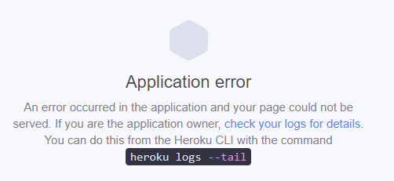
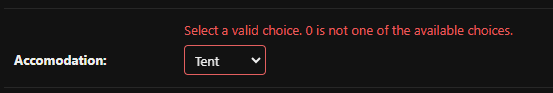
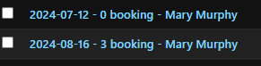
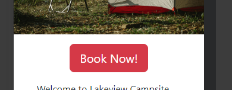
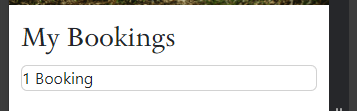
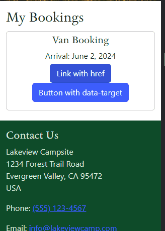
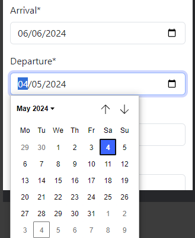
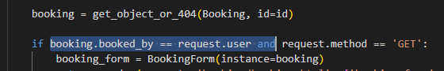

# Campsite Bookings - Testing

Deployed program on Heroku: [Campsite Bookings]()

## Contents
- 
    - 
- [Testing](#testing)
    - [Manual Testing](#manual-testing)
    - [Full Testing](#full-testing)
    - [Automated Testing](#automated-testing)
- [Bugs](#bugs)
    - [Known Bugs](#known-bugs)
    - [Solved Bugs](#solved-bugs)

### Manual Testing
| User Stories | Achieved by: | Supporting Images |
| --- | --- | --- | 

### Full Testing
The program was deployed on Heroku and tested there on a Windows 10 desktop with a 26" monitor and on a One Plus 9 Pro mobile phone.

The site was tested on Google Chrome on desktop, and DuckDuckGo on mobile.

| Feature | Expected Outcome | Test Performed | Results | Test Status |
| --- | --- | --- | --- | --- | 

### Automated Testing

## Bugs
### Known Bugs
| # | Bug | Image | Plan to Solve |
| --- | --- | --- | --- |

### Solved Bugs
| # | Bug | Image | Solution |
| --- | --- | --- | --- |
| 1 | When initially deployed to Heroku, the app did not run. |  | The full logs showed that there was a `H10` error which allowed me to find a solution in a thread on Slack. The issue was caused by not adding the `DATABASE_URL` and `SECRET_KEY` values to the config vars in Heroku. |
| 2 | When creating a booking, the accommodation options were not being accepted by the system. |  | The error was discovered to be an incorrect field being used in the models.py file: `accomodation = models.TextField(choices=ACCOMODATION, default=0)`. The TextField was changed to an IntegerField and the options were then valid in the admin panel. |
| 3 | In the admin panel, when returning a string for the bookings using a method, the integer value of the accommodation field was displayed instead of the desired string value. |  | The solution to this was found on [Stack Overflow](https://stackoverflow.com/questions/60556709/how-do-i-get-the-string-value-of-the-tuple-in-django) |
| 4 | When applying custom CSS classes to Bootstrap components, the styles were not taking effect and only the Bootstrap defaults were being shown. |  | This issue was solved by moving my style.css link to be after my Boostrap link in the base.html file. This allowed the custom style to be applied after Bootstrap styles had been called. |
| 5 | When the DateInput widget was included in the BookingForm model, the front-end input did not give any type of date picker interface. The Django docs did not list any other arguments to include to make this work. |  | A post was found on [Stack Overflow](https://stackoverflow.com/questions/61076688/django-form-dateinput-with-widget-in-update-loosing-the-initial-value) that included attribute values inside the DateInput widget. This allowed the user to select a date from a calendar.  |
| 6 | After adding code to show a success message after a booking is made, no toast appeared on the webpage. | | The necessary HTML code to show a div containing the messages was omitted. After including this code, the messages began displaying correctly. |
| 7 | When declaring `clean` methods inside the form class, the user is able to submit forms regardless of data validation. The method does not seem to be called when `is_valid()` is run. | | The `if` statements were not testing for the right conditions. Using `print` statements, the developer better understood the `POST` process and how the data was handled. The `clean` method was updated to properly validate the data and it then worked as expected. |
| 8 | After logging in or logging out, the user is redirected to the home page instead of the previous page they were viewing. |  | The code `?next={{request.path}}` was appended to each href in the relevant anchor tags throughout the website. |
| 9 | The integer value in the accommodation tuple was displayed in HTML instead of the desired string value. |  | A new method `string_from_tuple` which uses `dict` and `get` was written to return the string value from the accommodation tuple given a certain integer.  |
| 10 | The base code for the collapse component taken from the Bootstrap documentation did not work when the link or button were clicked. |  | This post on [StackOverflow](https://stackoverflow.com/questions/22955916/bootstrap-collapse-not-collapsing) highlighted a change in the attributes names. For example, `data-toggle` is now `data-bs-toggle` and `data-target` is `data-bs-target` etc. |
| 11 | When the user viewing their bookings clicked on the collapse component for one particular booking, all bookings expanded. |  | The use of `{{ booking.booking_id }}` as the unique collapse ID was correct however it needed to be preprended by the word "collapse" for it to work properly. |
| 12a | When using the DateInput field in the form, the departure date was not being limited as expected and could be assigned a value earlier than the arrival date. |  | Using print statements, it was discovered that the date values were being manipulated in a format not acceptable to the DateInput field. It was necessary to refactor the date back into the expected format by getting the year month and day separately. |
| 12b | After solving Bug #12a, the departure date was still not being limited to the correct month. | |  The `getMonth()` method is 0-indexed so the month value needed to be incremented by 1 for the date to be properly restricted, i.e. 0 corresponded to January, 1 to February etc. |
| 13 | The departure date was not always restricted to at least one day after the selected arrival date. | | The new Date variable needed to be instantiated with the arrival date value otherwise it returned erroneous values. The use of `console.log()` statements showing the erroneous values allowed this error to be discovered. |
| 14 | When logged in as a non-superuser, adding any booking ID to the end of .../booking/my-bookings/edit/ allowed the user to view the details and amend the bookings. |  | The highlighted code in the image was added to the booking_edit view. This ensured only the authorised user was able to view the details and additionally a PermissionDenied exception was explicitly raised otherwise. |

Back to [README.md](/README.md)