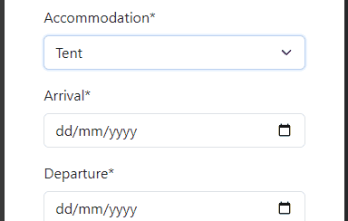
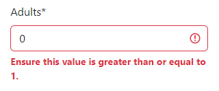
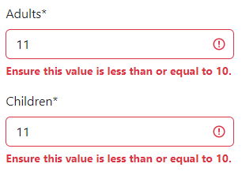
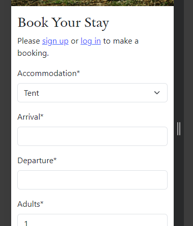
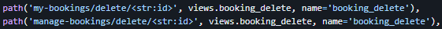

# Campsite Bookings - Testing

Deployed program on Heroku: [Campsite Bookings](https://lakeview-campsite-8b683b53a1cd.herokuapp.com/)


## Contents
- [Form Validation](#form-validation)
    - [Accomodation Type](#accommodation-type)
    - [Booking Dates](#booking-dates)
    - [Guest Numbers](#guest-numbers)
    - [Terms and Conditions](#terms-and-conditions)
    - [Form Submission](#form-submission)
    - [Viewing Bookings](#viewing-bookings)
    - [Changing Bookings](#changing-bookings)
    - [Deleting Bookings](#deleting-bookings)
    - [Accounts Pages](#accounts-pages)
- [Testing](#testing)
    - [Manual Testing](#manual-testing)
    - [Full Testing](#full-testing)
    - [Automated Testing](#automated-testing)
- [Bugs](#bugs)
    - [Known Bugs](#known-bugs)
    - [Solved Bugs](#solved-bugs)

## Form Validation
Validating the data to be submitted by the user is done both on the back and front end. 

### Accommodation Type
The dropdown list of four accommodation types is pre-selected to "Tent" and it is impossible to unselect any option in the list. This value is set in the `models.py` file.



```
    accommodation = models.IntegerField(choices=ACCOMMODATION, default=0)
```

### Booking Dates
The minimum values of the arrival and departure dates are set in the `forms.py` file:
        
```
widgets = {
    'arrival': DateInput(attrs={
        'type': 'date',
        'id': 'arrival',
        'min': date.today() + timedelta(days=1)
        }),
    'departure': DateInput(attrs={
        'type': 'date',
        'id': 'departure',
        'min': date.today() + timedelta(days=2)
        }),
}
```

They are set such that the minimum value of arrival is always tomorrow from the point of view of the user, and the departure date is always at least the day after tomorrow.
In most cases the arrival date will be selected first, so the minimum departure must be updated dynamically. this was achieved using [custom JavaScript code](static/js/booking.js). The custom code adds an event listener to the arrival input field and when the value is changed, set the new minimum departure date to be one day after the chosen arrival date.

In cases where the user has selected a departure date and then updates the arrival date to be equal to or after the departure, the form is prevented from being submitted and the user is informed of their error.


### Guest Numbers
If users attempt to submit the form with values less than the minimum or greater than the maximum values for the adults and children fields, the form does not submit and the user is informed of their error.






These limits are set in `booking/models.py` using Django core validator classes as shown below:

```
adults = models.PositiveIntegerField(default=1, validators=[MinValueValidator(1), MaxValueValidator(10)])
children = models.PositiveIntegerField(default=0, validators=[MaxValueValidator(10)])
```

### Terms and Conditions
If the user does tick the radio button, the form is prevented from being submitted and a message is displayed reminding the user that they must accept the Terms and Conditions to proceed with the booking.


### Form Submission
When the submit button is clicked on the booking form, the view checks that the requested method is POST and then that the form data is valid. 
```
if request.method == 'POST':
    booking_form = BookingForm(data=request.POST)
```

Passing these checks, the data is saved to the database. If the data is found to be invalid, the page is re-rendered with the data pre-filled in the form, and any error or validation messages are displayed to the user.

### Viewing Bookings
When a user click the "My Bookings" nav bar link, they are brought to the `user_bookings.html` page. This page calls a view that is dependent on the user viewing the page. The queryset of bookings displayed is filtered based on the model's `booked_by` field matching the requesting user.

```
queryset = Booking.objects.all().order_by('-arrival').filter(booked_by=self.request.user)
```

In this way, it is impossible for one user to access another user's booking details even though the page url is the same.

### Changing Bookings
The Edit button is rendered differently on the frontend based on whether the booking is withing the next 48 hours. If is is, the button displayed links to a modal on the page instead of the `edit/` url. The Manage button does not have this limitation. In either case, when a user clicks the Edit or Manage button for a given booking, their identity is verified in the `booking_edit` view. The login_required decorator redirects them to the login url if they are not signed in. This is a backup security check as the user should only be able to view this page after they have logged in.

```
if booking.booked_by == request.user or request.user.is_staff:
```

If this check passes, another if statement checks that requested method is GET. Validating to True, the form is filled with the booking data and the page is rendered.
If the requested method is POST, the booking model is populated with the amended data and is verified using the `is_valid()` method before being saved to the database. If the data is invalid, a HttpsResponseBadRequest is returned and the form is not submitted.

If the if statement above validates to False, a PermissionDenied exception is raised.

### Deleting Bookings
When a user clicks the Delete button for a given booking, their identity is verified in the `booking_delete` view. The login_required decorator is also included before this view to carry the same purpose as described above. If the identity checks pass, a second check takes places to verify the user's identity in conjunction with the `is_within_48h()` method. This ensures that the user receives the correct permissions to edit the details, i.e. the booking owner cannot delete a booking within 48 hours of arrival but a staff user can.

```
if booking.booked_by == request.user or request.user.is_staff:
    if ( booking.booked_by == request.user and not booking.is_within_48h() ) or request.user.is_staff :
        booking.delete()
```

If these conditions are satisfied, the booking is deleted from the database and the user is redirected to either `user_bookings.html` or `manage_booking.html` as shown below:

```
if request.user.is_staff:
    return redirect ('manage_bookings')
else:
    return redirect('user_bookings')
```

### Accounts Pages
The sign in, sign out, sign up, and reset password pages already come with form validation in the Django package. Full testing of these pages is detailed below in [Manual Testing](#manual-testing).

## Testing

### Manual Testing
**User Stories** | **Achieved By:** | **Supporting Images**
--- | --- | ---
**Initial Project Setup** | | 
Set Up Django Files | Installing the correct version of Django in the IDE. Creating a project named "lakeview". Creating an app called "home" and writing a basic view to display "Hello World!" on the homepage. | [Closed Issue on kanban board](static/images/readme/kanban-setup.png)
Create PostgreSQL Database | Creating an ElephantSQL account and generating a new database instance. Add the correct values to the settings file and creating the env.py file. Installing the relevant packages to faciliate databse connection and running migrations. |  [Closed Issue on kanban board](static/images/readme/kanban-create.png)
Deploy Project to Heroku | Creating a new Heroku app and updating the code with gunicorn before deploying the branch. |  [Closed Issue on kanban board](static/images/readme/kanban-deploy-heroku.png)
Deploy Heroku App with Static Files | Setting up the WhiteNoise module and updating the settings file with the relevant information. Creating a staticfiles directory and running the `collectstatic` command. Deploing a new branch on Heroku and verifying all styling is applied. |  [Closed Issue on kanban board](static/images/readme/kanban-deploy-static.png)
**Create Models** | | 
Create Bookings Model | Creating a booking app in Django and a model file with the necessary imports. Creating the model itself with all the appropriate fields shown in the ERD. | [Closed Issue on kanban board](static/images/readme/kanban-create-model.png) 
Move Booking Model to the Correct App | Create a new model in the correct app and changing all referneces in other files to this new model. Running migrations and checking for errors before deleting the old model. |  [Closed Issue on kanban board](static/images/readme/kanban-move-model.png)
**User Accounts** | | 
Create an Account | Clicking the Sign In button and registering personal details in the form. Submitting the form with valid data. | [1. Sign Up Page (top)](static/images/readme/signup-1.png) [2. Sign Up Page (bottom)](static/images/readme/signup-2.png)
**Website Content** | | 
Create Base Template | Creating a base.html file with the common code that will be used across all webpages such as the style links, header, and footer. |  [Closed Issue on kanban board](static/images/readme/kanban-base.png)
View Campsite Information | Navigating to the About page and viewing the content displayed there. |  [1. Website Header (mobile)](static/images/readme/header-dd-user.png) [2. Website Header (dekstop)](static/images/readme/header-nav-user.png) [3. Website Footer](static/images/readme/footer-mob.png)
Create Error Pages | Creating a 404.htmt, 403.html, and 500.html page and storing them in the same directory as base.html |  [1. 404 Error Page](static/images/readme/error404.png) [2. 403 Error Page](static/images/readme/error403.png) [3. 500 Error Page](static/images/readme/error500.png)
**Bookings System** | | 
Make a Booking | Navigating to the Bookings page and selecting an accomodation option, booking dates, and number of guests. |  [Booking Form Page](static/images/readme/booking-form.png)
View My Bookings | Navigating to the My Bookings page and viewing the list of displayed upcoming and past booking. Clicking the link in each booking to view more details. |  [1. My Bookings Page](static/images/readme/my-bookings.png) [2. More details on Bookings Page](static/images/readme/my-booking-details.png)
Edit a Booking | Selecting a valid booking to edit and amending the details in the form provided. |  [Editing a Booking](static/images/readme/edit-booking.png)
Delete a Booking | Selecting a valid booking to delete and confirming the action in the provided modal message. |  [Deleting a Booking](static/images/readme/delete-booking.png)
View All Bookings | Navigating to the Manage Bookings page when logged in with a staff account and viewing the list of all bookings. |  [1. Managing Bookings (top)](static/images/readme/manage-bookings.png) [2. Managing Bookings (bottom)](static/images/readme/manage-bookings-2.png)
**Bugs** | | 
Detail and Keep Track of Bugs | Utilising the Kanban board to track bugs and the actions taken to attempt to solve the issues. |  [Kanban Board view of Bugs](static/images/readme/kanban-bugs.png)

### Full Testing
The program was deployed on Heroku and tested there on a Windows 10 desktop with a 26" monitor and on a One Plus 9 Pro mobile phone.

The site was tested on Google Chrome, Mozilla Firefox, and Edge on desktop, DuckDuckGo on mobile, and using Chrome Developer Tools for some other screen sizes.

**Feature**|**Expected Outcome**|**Test Performed**|**Results**|**Test Status**
-----|-----|-----|-----|-----
**All Pages**| | | | 
Navbar Title Link|When clicked, the user is redirected to the homepage.|Link clicked|User redirected to homepage|Pass
Navbar Menu|When clicked, the navbar menu is displayed with its links.|Menu clicked|The navbar menu was displayed|Pass
Navbar About Link|When clicked, the user is redirected to the About page.|Link clicked|User redirected to About page|Pass
Navbar Book Now Link|When clicked, the user is redirected to the Booking page.|Link clicked|User redirected to Booking page|Pass
Navbar Log In Link|When clicked, the user is redirected to the Sign In page.|Link clicked|User redirected to Sign In page|Pass
Navbar Sign Up Link|When clicked, the user is redirected to the Sign Up page.|Link clicked|User redirected to Sign Up page|Pass
Navbar Sign Out Link|When clicked, the user is redirected to the Sign Out page.|Link clicked|User redirected to Sign Out page|Pass
Navbar My Bookings Link|When clicked, the user is redirected to the My Bookings page.|Link clicked|User redirected to My Bookings page|Pass
Navbar Manage Bookings Link|When clicked, the user is redirected to the Manage Bookings page.|Link clicked|User redirected to Manage Bookings page|Pass
**Home Page**| | | | 
Book Now Button|When clicked, the user is redirected to the Bookings page.|Link clicked|User redirected to My Bookings page|Pass
Learn More Button|When clicked, the user is redirected to the About page.|Link clicked|User redirected to homepage|Pass
Footer Phone Number Link|When clicked, the device asks to confirm opening in another app. App opens prefilled with the phone number.|Link clicked and confirmation given.|App opened with phone number prefilled|Pass
Footer Email Link|When clicked, the device asks to confirm opening in another app. App opens with email address prefilled in To field.|Link clicked and confirmation given.|App opened with email address prefilled in To field|Pass
Footer Facebook Link|When clicked, the linked webpage is opened in a new tab.|Link clicked|Webpage was opened in a new tab.|Pass
Footer Instagram Link|When clicked, the linked webpage is opened in a new tab.|Link clicked|Webpage was opened in a new tab.|Pass
Footer X Link|When clicked, the linked webpage is opened in a new tab.|Link clicked|Webpage was opened in a new tab.|Pass
Signed Out Message|When the X is clicked on the confirmation message, the message is dismissed.|The X was clicked|The message was dismissed.|Pass
**About Page**| | | | 
Book Now Button 1|When clicked, the user is redirected to the Booking page.|Link clicked|User redirected to Booking page|Pass
Carousel Left Chevron|When clicked, the previous image in the carousel is shown.|Left chevron clicked|Prevous image was shown|Pass
Carousel Right Chevron|When clicked, the next image in the carousel is shown.|Right chevron clicked|Next image was shown|Pass
Book Now Button 2|When clicked, the user is redirected to the Booking page.|Link clicked|User redirected to Booking page|Pass
**Bookings Page**| | | | 
Sign Up Link|When clicked, the user is redirected to the Sign Up page.|Link clicked|User redirected to Sign Up page|Pass
Log In Link|When clicked, the user is redirected to the Sign In page.|Link clicked|User redirected to Sign In page|Pass
Accommodation Dropdown Field|When clicked, the dropdown list of accomodation options is shown.|Field clicked|The options were displayed|Pass
Accommodation Dropdown Field|When an option is clicked, it is selected as the field value.|All options clicked in turn.|Clicked options were selected as the field value|Pass
Accommodation Dropdown Field|When the dropdown is displayed, the up and down arrow keys can be used to change selection.|Up and down arrow keys pressed|The selection changed|Pass
Accommodation Dropdown Field|When an option is highlighted, the enter key can be used to select it.|Enter key pressed|Highlighted option selected as the field value|Pass
Arrival Field|When the field is clicked, only numbers can be entered.|Field clicked and numbers, letters, and symbols typed|Only numbers are accepted by the field|Pass
Arrival Field|When an invalid date, or a date earlier than the minimum value is entered into the Arrival field, the form cannot be submitted and a validation message is displayed to the user.|Invalid data entered|The form did not submit and a validation message was displayed|Pass
Arrival Field|When the calendar icon is clicked, a calendar date picker is displayed.|Calendar icon clicked|Calendar date picker displayed|Pass
Arrival Field|When the calendar date picker is displayed, the earliest selectable date is always tomorrow.|Today's date and earlier clicked|Days earlier than tomorrow were not able to be selected|Pass
Arrival Field|When the calendar date picker clear button is clicked, the field data is cleared.|Calendar clear button clicked|The field data was cleared|Pass
Departure Field|When the field is clicked, only numbers can be entered.|Field clicked and numbers, letters, and symbols typed|Only numbers are accepted by the field|Pass
Departure Field|When an invalid date, or a date earlier than the minimum value is entered into the Departure field, the form cannot be submitted and a validation message is displayed to the user.|Invalid data entered and Submit button clicked|The form did not submit|Pass
Departure Field|When an Arrival date is selected, the earliest date that can be selected  in the Departure calendar picker is one day after the Arrival date.|Arrival date chosen. Selecting Departure date to be the same day or earlier attempted.|Days equal to or earlier than the chosen Arrival date were not able to be selected|Pass
Departure Field|When valid Arrival and Departure dates are selected, and the Arrival date is changed to be later than the Depature date, the form cannot be submitted and a validation message is displayed to the user.|Arrival date changed to be after the Departure date and Submit button clicked|The form did not submit and a validation message was displayed|Pass
Departure Field|When the calendar icon is clicked, a calendar date picker is displayed.|Calendar icon clicked|Calendar date picker displayed|Pass
Departure Field|When the calendar date picker is displayed, the earliest selectable date is always tomorrow.|Today's date and earlier clicked|Days earlier than tomorrow were not able to be selected|Pass
Departure Field|When the calendar date picker clear button is clicked, the field data is cleared.|Calendar clear button clicked|The field data was cleared|Pass
Adults Field|When the field is clicked, only floating-point numbers can be entered.|Field clicked and numbers, letters, and symbols typed|Numbers, the symbols `+`, `-`, and `.`, and the letter `e` were accepted|Pass
Adults Field|When data containing a `.` is entered into the field, the form cannot be submitted and a validation message is shown|Data containing a `.` is entered in the field nd the Submit button clicked.|The form did not submit and a validation message was displayed|Pass
Adults Field|When data containing a a `+` is entered into the field, the form cannot be submitted and a validation message is shown|Data containing a `+` is entered in the field nd the Submit button clicked.|The form did not submit and a validation message was displayed|Pass
Adults Field|When data containing a a `-` is entered into the field, the form cannot be submitted and a validation message is shown|Data containing a `-` is entered in the field nd the Submit button clicked.|The form did not submit and a validation message was displayed|Pass
Adults Field|When data containing a `e` is entered into the field, the form cannot be submitted and a validation message is shown|Data containing a  `e` is entered in the field nd the Submit button clicked.|The form did not submit and a validation message was displayed|Pass
Adults Field|When a number less than 1 or greater than 10 is entered, the form cannot be submitted and a validation message is shown.|Numbers less than 1 and greater than 10 were entered in turn.|The form did not submit and a validation message was displayed|Pass
Children Field|When the field is clicked, only floating-point numbers can be entered.|Field clicked and numbers, letters, and symbols typed|Numbers, the symbols `+`, `-`, and `.`, and the letter `e` were accepted|Pass
Children Field|When a `.` is entered into the field, the form cannot be submitted and a validation message is shown|A `.` is entered in the field nd the Submit button clicked.|The form did not submit and a validation message was displayed|Pass
Children Field|When a `+` is entered into the field, the form cannot be submitted and a validation message is shown|A `+` is entered in the field nd the Submit button clicked.|The form did not submit and a validation message was displayed|Pass
Children Field|When a `-` is entered into the field, the form cannot be submitted and a validation message is shown|A `-` is entered in the field nd the Submit button clicked.|The form did not submit and a validation message was displayed|Pass
Children Field|When `e` is entered into the field, the form cannot be submitted and a validation message is shown|A  `e` is entered in the field nd the Submit button clicked.|The form did not submit and a validation message was displayed|Pass
Children Field|When a number less than 0 or greater than 10 is entered, the form cannot be submitted and a validation message is shown.|Numbers less than 0 and greater than 10 were entered in turn.|The form did not submit and a validation message was displayed|Pass
Terms and Conditions Field|When the radio button is clicked, the field is marked as selected.|Radio button clicked|The field was marked as selected.|Pass
Terms and Conditions Field|When the radio button is clicked again, the field is unmarked as selected.|Radio button clicked|The field was unmarked as selected.|Pass
Submit Button|When the button is clicked with invalid or empty data in any of the fields, the form does not submit and validation messages are shown.|Submit button clicked with empty fields and/or invalid data entered into fields.|The form did not submit and a validation message was displayed|Pass
Submit Button|When the button is clicked with valid data in all fields, the form submits and a confirmation message is displayed.|Submit button clicked with valid data in form fields.|The form submits and a confirmation message is displayed to the user.|Pass
Booking Confirmation Message|When the X is clicked on the confirmation message, the message is dismissed.|The X was clicked|The message was dismissed.|Pass
View Terms and Conditions Link|When the "View Terms and Conditions" link is click, the list of terms is displayed.|Link clicked|The full list of terms was displayed|Pass
View Terms and Conditions Link|When the "View Terms and Conditions" link is clicked again, the list of terms is hidden.|Link clicked again|The full list of terms was hidden|Pass
Hide Terms and Conditions Link|When the "Hide Terms and Conditions" link is clicked, the list of terms is hidden.|Link clicked|The full list of terms was hidden|Pass
**My Bookings Page**| | | | 
More Details Link|When the More Details link is clicked for a booking card, the booking's details are shown.|More Details link clicked|The booking's details were shown|Pass
Edit Button|When the Edit button is clicked for a booking in the next 48 hours, the "amend" modal is displayed.|Edit button clicked for booking in the next 48 hours|The "amend" modal was displayed.|Pass
Delete Button|When the Delete button is clicked for a booking in the next 48 hours, the "amend" modal is displayed.|Delete button clicked for booking in the next 48 hours|The "amend" modal was displayed.|Pass
Amend Modal Phone Number Link|When the phone number link in the modal is clicked, the device asks to confirm opening another app. App opens prefilled with the phone number.|Link clicked and confirmation given|App opened with phone number prefilled|Pass
Amend Modal Understood Button|When the Understood button in the modal is clicked, the modal is dismissed and no other action is taken.|Understood button clicked|The modal was dismissed and no other action was taken.|Pass
Edit Button|When the Edit button is clicked for a booking more than 48 hours away, the user is redirected to the Bookings page with the form prefilled with the booking data.|Edit button clicked|The user was redirected to the Bookings page with the form prefilled with the booking data.|Pass
Booking Updated Message|When the X is clicked on the confirmation message, the message is dismissed.|The X was clicked|The message was dismissed.|Pass
Delete Button|When the Delete button is clicked for a booking more than 48 hours away, the "delete" modal is displayed.|Delete button clicked|The "delete" modal was displayed.|Pass
Delete Modal Cancel Button|When the Cancel button in the delete modal is clicked, the modal is dismissed and no other action is taken.|Cancel button clicked|The modal was dismissed and no other action was taken.|Pass
Delete Modal Delete Button|When the Delete button in the delete modal is clicked, the booking is deleted and a confirmation message is displayed.|Delete button clicked|The bookin was deleted and a confirmation message was displayed.|Pass
Booking Deleted Message|When the X is clicked on the confirmation message, the message is dismissed.|The X was clicked|The message was dismissed.|Pass
**Edit Bookings Page**| | | | 
Accommodation Dropdown Field|When clicked, the dropdown list of accomodation options is shown.|Field clicked|The options were displayed|Pass
Accommodation Dropdown Field|When an option is clicked, it is selected as the field value.|All options clicked in turn.|Clicked options were selected as the field value|Pass
Accommodation Dropdown Field|When the dropdown is displayed, the up and down arrow keys can be used to change selection.|Up and down arrow keys pressed|The selection changed|Pass
Accommodation Dropdown Field|When an option is highlighted, the enter key can be used to select it.|Enter key pressed|Highlighted option selected as the field value|Pass
Arrival Field|When the field is clicked, only numbers can be entered.|Field clicked and numbers, letters, and symbols typed|Only numbers are accepted by the field|Pass
Arrival Field|When an invalid date, or a date earlier than the minimum value is entered into the Arrival field, the form cannot be submitted and a validation message is displayed to the user.|Invalid data entered|The form did not submit and a validation message was displayed|Pass
Arrival Field|When the calendar icon is clicked, a calendar date picker is displayed.|Calendar icon clicked|Calendar date picker displayed|Pass
Arrival Field|When the calendar date picker is displayed, the earliest selectable date is always tomorrow.|Today's date and earlier clicked|Days earlier than tomorrow were not able to be selected|Pass
Arrival Field|When the calendar date picker clear button is clicked, the field data is cleared.|Calendar clear button clicked|The field data was cleared|Pass
Departure Field|When the field is clicked, only numbers can be entered.|Field clicked and numbers, letters, and symbols typed|Only numbers are accepted by the field|Pass
Departure Field|When an invalid date, or a date earlier than the minimum value is entered into the Departure field, the form cannot be submitted and a validation message is displayed to the user.|Invalid data entered and Submit button clicked|The form did not submit|Pass
Departure Field|When an Arrival date is selected, the earliest date that can be selected  in the Departure calendar picker is one day after the Arrival date.|Arrival date chosen. Selecting Departure date to be the same day or earlier attempted.|Days equal to or earlier than the chosen Arrival date were not able to be selected|Pass
Departure Field|When valid Arrival and Departure dates are selected, and the Arrival date is changed to be later than the Depature date, the form cannot be submitted and a validation message is displayed to the user.|Arrival date changed to be after the Departure date and Submit button clicked|The form did not submit and a validation message was displayed|Pass
Departure Field|When the calendar icon is clicked, a calendar date picker is displayed.|Calendar icon clicked|Calendar date picker displayed|Pass
Departure Field|When the calendar date picker is displayed, the earliest selectable date is always tomorrow.|Today's date and earlier clicked|Days earlier than tomorrow were not able to be selected|Pass
Departure Field|When the calendar date picker clear button is clicked, the field data is cleared.|Calendar clear button clicked|The field data was cleared|Pass
Adults Field|When the field is clicked, only floating-point numbers can be entered.|Field clicked and numbers, letters, and symbols typed|Numbers, the symbols `+`, `-`, and `.`, and the letter `e` were accepted|Pass
Adults Field|When data containing a `.` is entered into the field, the form cannot be submitted and a validation message is shown|Data containing a `.` is entered in the field nd the Submit button clicked.|The form did not submit and a validation message was displayed|Pass
Adults Field|When data containing a a `+` is entered into the field, the form cannot be submitted and a validation message is shown|Data containing a `+` is entered in the field nd the Submit button clicked.|The form did not submit and a validation message was displayed|Pass
Adults Field|When data containing a a `-` is entered into the field, the form cannot be submitted and a validation message is shown|Data containing a `-` is entered in the field nd the Submit button clicked.|The form did not submit and a validation message was displayed|Pass
Adults Field|When data containing a `e` is entered into the field, the form cannot be submitted and a validation message is shown|Data containing a  `e` is entered in the field nd the Submit button clicked.|The form did not submit and a validation message was displayed|Pass
Adults Field|When a number less than 1 or greater than 10 is entered, the form cannot be submitted and a validation message is shown.|Numbers less than 1 and greater than 10 were entered in turn.|The form did not submit and a validation message was displayed|Pass
Children Field|When the field is clicked, only floating-point numbers can be entered.|Field clicked and numbers, letters, and symbols typed|Numbers, the symbols `+`, `-`, and `.`, and the letter `e` were accepted|Pass
Children Field|When a `.` is entered into the field, the form cannot be submitted and a validation message is shown|A `.` is entered in the field nd the Submit button clicked.|The form did not submit and a validation message was displayed|Pass
Children Field|When a `+` is entered into the field, the form cannot be submitted and a validation message is shown|A `+` is entered in the field nd the Submit button clicked.|The form did not submit and a validation message was displayed|Pass
Children Field|When a `-` is entered into the field, the form cannot be submitted and a validation message is shown|A `-` is entered in the field nd the Submit button clicked.|The form did not submit and a validation message was displayed|Pass
Children Field|When `e` is entered into the field, the form cannot be submitted and a validation message is shown|A  `e` is entered in the field nd the Submit button clicked.|The form did not submit and a validation message was displayed|Pass
Children Field|When a number less than 0 or greater than 10 is entered, the form cannot be submitted and a validation message is shown.|Numbers less than 0 and greater than 10 were entered in turn.|The form did not submit and a validation message was displayed|Pass
Terms and Conditions Field|When the radio button is clicked, the field is marked as selected.|Radio button clicked|The field was marked as selected.|Pass
Terms and Conditions Field|When the radio button is clicked again, the field is unmarked as selected.|Radio button clicked|The field was unmarked as selected.|Pass
Update Button|When the button is clicked with invalid or empty data in any of the fields, the form does not submit and validation messages are shown.|Update button clicked with empty fields and/or invalid data entered into fields.|The form did not submit and a validation message was displayed|Pass
Update Button|When the button is clicked with valid data in all fields, the form submits and a confirmation message is displayed.|Update button clicked with valid data in form fields.|The form submits and a confirmation message is displayed to the user.|Pass
View Terms and Conditions Link|When the "View Terms and Conditions" link is click, the list of terms is displayed.|Link clicked|The full list of terms was displayed|Pass
View Terms and Conditions Link|When the "View Terms and Conditions" link is clicked again, the list of terms is hidden.|Link clicked again|The full list of terms was hidden|Pass
Hide Terms and Conditions Link|When the "Hide Terms and Conditions" link is clicked, the list of terms is hidden.|Link clicked|The full list of terms was hidden|Pass
**Manage Bookings Page**| | | | 
Manage Button|When the Manage button is clicked for a booking, the user is redirected to the Bookings page with the form prefilled with the booking data.|Edit button clicked|The user was redirected to the Bookings page with the form prefilled with the booking data.|Pass
Booking Updated Message|When the X is clicked on the confirmation message, the message is dismissed.|The X was clicked|The message was dismissed.|Pass
Delete Button|When the Delete button is clicked for a booking, the "delete" modal is displayed.|Delete button clicked|The "delete" modal was displayed.|Pass
Delete Modal Cancel Button|When the Cancel button in the delete modal is clicked, the modal is dismissed and no other action is taken.|Cancel button clicked|The modal was dismissed and no other action was taken.|Pass
Delete Modal Delete Button|When the Delete button in the delete modal is clicked, the booking is deleted and a confirmation message is displayed.|Delete button clicked|The bookin was deleted and a confirmation message was displayed.|Pass
Booking Deleted Message|When the X is clicked on the confirmation message, the message is dismissed.|The X was clicked|The message was dismissed.|Pass
**Sign Up Page**| | | | 
Sign In Link|When clicked, the user is redirected to the Sign In page.|Link clicked|User redirected to Sign In page|Pass
Username Field|When the field is left blank and the Sign Up button is clicked, a validation message is displayed and the form is not submitted.|Username field left blank and Sign Up button clicked.|A validation message was displayed and the form was not submitted|Pass
Username Field|When only whitespace is entered in the field and the Sign Up button is clicked, a validation message is displayed and the form is not submitted.|Whitespace entered in the username field and Sign Up button clicked.|A validation message was displayed and the form was not submitted|Pass
Username Field|When characters other than letters, numbers and `@`, `.`, `+`, `-`, or `_` are entered in the field and the Sign Up button is clicked, a validation message is displayed and the form is not submitted.|Characters other than letters, numbers and `@`, `.`, `+`, `-`, or `_` were entered in the username field and Sign Up button clicked.|A validation message was displayed and the form was not submitted|Pass
Username Field|When any ASCII characters are entered to make up a username and the Sign Up button is clicked, the input is accepted, the form is submitted, and a confirmation message is displayed.|Usernames made up of any ASCII characters were entered and Sign Up button clicked|The input was accepted, the form was submitted, and a confirmation message was displayed.|Pass
Email Field|When the field is left blank and the Sign Up button is clicked, the form is submitted.|Field left blank and Sign Up button clicked|The form was submitted.|Pass
Email Field|When text is entered that does not match the accepted email format and the Sign Up button is clicked, a validation message is displayed and the form is not submitted.|Text entered that did not match the accepted email format and Sign up button clicked.|A validation message was displayed and the form was not submitted|Pass
Email Field|When text is entered that matches the accepted email format and the Sign Up button is clicked, the form is submitted and a confirmation message is displayed.|Text entered that matched the accepted email format and Sign up button clicked.|The input was accepted, the form was submitted, and a confirmation message was displayed.|Pass
Password Fields|When both fields are left blank and the Sign Up button is clicked, a validation message is displayed and the form is not submitted.|Both fields left blank and Sign Up button clicked.|A validation message was displayed and the form was not submitted|Pass
Password Fields|When only one field is left blank and the Sign Up button is clicked, a validation message is displayed and the form is not submitted.|One field left blank and Sign Up button clicked.|A validation message was displayed and the form was not submitted|Pass
Password Fields|When the two fields contain different passwords and the Sign Up button is clicked, a validation message is displayed and the form is not submitted.|Different passwords entered into both fields and Sign Up button clicked.|A validation message was displayed and the form was not submitted|Pass
Password Fields|When a password similar to the username is entered and the Sign Up button is clicked, a validation message is displayed and the form is not submitted.|Password similar to the username entered into the field and Sign Up button clicked.|A validation message was displayed and the form was not submitted|Pass
Password Fields|When a password less than eight characters in length is entered and the Sign Up button is clicked, a validation message is displayed and the form is not submitted.|Password less than eight characters entered into the field and Sign Up button clicked.|A validation message was displayed and the form was not submitted|Pass
Password Fields|When a password made up of numbers is entered and the Sign Up button is clicked, a validation message is displayed and the form is not submitted.|Password made entirely of numbers entered into the field and Sign Up button clicked.|A validation message was displayed and the form was not submitted|Pass
Password Fields|When a simple password is entered, e.g. "password" and "pass1234" and the Sign Up button is clicked, a validation message is displayed and the form is not submitted.|Common passwords were entered into the field and Sign Up button clicked.|A validation message was displayed and the form was not submitted|Pass
Password Fields|When a password that satisfies the stated requirement on the page is entered and the Sign Up button is clicked, the form is submitted and a confirmation message is displayed.|Password that satisfised the stated requirements was entered into the field and Sign Up button clicked.|The input was accepted, the form was submitted, and a confirmation message was displayed.|Pass
Sign Up Button|When any fields contain invalid data and the Sign Up button is clicked, a validation message is displayed and the form is not submitted.|Invalid data entered into form fields and Sign Up button clicked.|A validation message was displayed and the form was not submitted|Pass
Sign Up Button|When all fields contain valid data and the Sign Up button is clicked, the form is submitted and a confirmation message is displayed.|Valid data entered into all form fields and Sign Up button clicked.|The input was accepted, the form was submitted, and a confirmation message was displayed.|Pass
Signed In Message|When the X is clicked on the confirmation message, the message is dismissed.|The X was clicked|The message was dismissed.|Pass
**Sign Out Page**| | | | 
Sign Out Button|When the Sign Out button is clicked, the user is signed out and redirected to the homepage.|Sign Out button clicked.|User was signed out and redirected to the homepage.|Pass
Cancel Button|When the Cancel button is clicked, the user is not signed out and is redirected to the previous page they were viewing.|Cancel button clicked|User was not signed out and was redirected to the previous page they were viewing.|Pass
**Sign In Page**| | | | 
Sign Up Link|When clicked, the user is redirected to the Sign Up page.|Link clicked|User redirected to Sign Up page|Pass
Username Field|When the field is left blank and the Sign In button is clicked, a validation message is displayed and the form is not submitted.|Username field left blank and Sign In button clicked.|A validation message was displayed and the form was not submitted|Pass
Username Field|When a username is entered that is not registered on the database and the Sign In button is clicked, a validation message is displayed and the form is not submitted.|Username and password entered that do not exist on the database and Sign In button clicked.|A validation message was displayed and the form was not submitted|Pass
Password Field|When an incorrect password for the respective username is entered and the Sign In button is clicked, a validation message is displayed and the form is not submitted.|Incorrect password entered for a given username and Sign In button clicked.|A validation message was displayed and the form was not submitted|Pass

### Automated Testing
The W3C validator sites were used to validate the HTML and CSS files. JSHint was used to validate the JavaScript files.
- [index.html](static/images/readme/w3c-index.png) - Passed with no errors or warnings.
- [about.html](static/images/readme/w3c-about.png) - Passed with no errors or warnings.
- [booking.html](static/images/readme/w3c-booking.png) - Passed with no errors or warnings.
- [user_bookings.html](static/images/readme/w3c-user-bookings.png) - Passed with no errors or warnings. Trailing slash in self-closing `<input/>` element is flagged as having no effect.
- [manage_bookings.hmtl](static/images/readme/w3c-manage.png) - Passed with no errors or warnings. Validated by direct input.
- [login.html](static/images/readme/w3c-login.png) - Passed with no errors or warnings. Trailing slash in self-closing `<input/>` element is flagged as having no effect.
- [logout.html](static/images/readme/w3c-logout.png) - Passed with no errors or warnings.
- [signup.html](static/images/readme/w3c-signup.png) - Four **false positive** errors flagged. Trailing slash in self-closing `<input/>` element is flagged as having no effect. 

    For some reason the W3C checker flagged:
    - A `<ul>` element as being unclosed when it does have a closing tag.
    - A `<span>` element as being unclosed and a stray closing `</span>` tag existing, when in fact these both form one complete span element.
    - A `</p>` end tag seen without a `<p>`element in the scope, even though it is there.
    
        

    Disregarding these false positives, the page has no other errors or warnings and as such is it considered "Passed".

- [403.html](static/images/readme/w3c-403.png) - Passed with no errors or warnings. Validated by direct input. 
- [404.html](static/images/readme/w3c-404.png) - Passed with no errors or warnings. Validated by direct input. 
- [500.html](static/images/readme/w3c-500.png) - Passed with no errors or warnings. Validated by direct input. 

- [style.css](static/images/readme/w3c-css.png) - No errors found.

#### Accessibility Testing
The WAVE tool was used to assess the website for any errors or issues associated with accessibility. The results and comments for each page are as follows:

##### Index Page
headings fixed, passed locally

##### About Page
passed with one alert for redundant link but this is by design

##### Bookings Page
logged out: passed with one alert for redundant link but this is by design
logged in: passed with no issues.

##### My Bookings Page
passed with one alert for redundant link but this is by design

##### Manage Bookings Page
passed

##### Sign In Page
passed

##### Sign Out Page
passed

##### Sign Up Page
passed

##### 403 Page
passed

##### 404 Page
passed

##### 500 Page

## Bugs
### Known Bugs
| # | Bug | Image | Plan to Solve |
| --- | --- | --- | --- |
| 1 | On some mobile screen sizes, the signup form fields are not visually consistent. Some are inline with their labels while others are on a new line. |  | Writing a custom form for the signup page will allow for more customisation and control. This will be implemented in a future version of the website. |

### Solved Bugs
| # | Bug | Image | Solution |
| --- | --- | --- | --- |
| 1 | When initially deployed to Heroku, the app did not run. |  | The full logs showed that there was a `H10` error which allowed me to find a solution in a thread on Slack. The issue was caused by not adding the `DATABASE_URL` and `SECRET_KEY` values to the config vars in Heroku. |
| 2 | When creating a booking, the accommodation options were not being accepted by the system. |  | The error was discovered to be an incorrect field being used in the models.py file: `accomodation = models.TextField(choices=ACCOMODATION, default=0)`. The TextField was changed to an IntegerField and the options were then valid in the admin panel. |
| 3 | In the admin panel, when returning a string for the bookings using a method, the integer value of the accommodation field was displayed instead of the desired string value. |  | The solution to this was found on [Stack Overflow](https://stackoverflow.com/questions/60556709/how-do-i-get-the-string-value-of-the-tuple-in-django) |
| 4 | When applying custom CSS classes to Bootstrap components, the styles were not taking effect and only the Bootstrap defaults were being shown. |  | This issue was solved by moving my style.css link to be after my Boostrap link in the base.html file. This allowed the custom style to be applied after Bootstrap styles had been called. |
| 5 | When the DateInput widget was included in the BookingForm model, the front-end input did not give any type of date picker interface. The Django docs did not list any other arguments to include to make this work. |  | A post was found on [Stack Overflow](https://stackoverflow.com/questions/61076688/django-form-dateinput-with-widget-in-update-loosing-the-initial-value) that included attribute values inside the DateInput widget. This allowed the user to select a date from a calendar.  |
| 6 | After adding code to show a success message after a booking is made, no toast appeared on the webpage. | | The necessary HTML code to show a div containing the messages was omitted. After including this code, the messages began displaying correctly. |
| 7 | When declaring `clean` methods inside the form class, the user is able to submit forms regardless of data validation. The method does not seem to be called when `is_valid()` is run. | | The `if` statements were not testing for the right conditions. Using `print` statements, the developer better understood the `POST` process and how the data was handled. The `clean` method was updated to properly validate the data and it then worked as expected. |
| 8 | After logging in or logging out, the user is redirected to the home page instead of the previous page they were viewing. |  | The code `?next={{request.path}}` was appended to each href in the relevant anchor tags throughout the website. |
| 9 | The integer value in the accommodation tuple was displayed in HTML instead of the desired string value. |  | A new method `string_from_tuple` which uses `dict` and `get` was written to return the string value from the accommodation tuple given a certain integer.  |
| 10 | The base code for the collapse component taken from the Bootstrap documentation did not work when the link or button were clicked. |  | This post on [StackOverflow](https://stackoverflow.com/questions/22955916/bootstrap-collapse-not-collapsing) highlighted a change in the attributes names. For example, `data-toggle` is now `data-bs-toggle` and `data-target` is `data-bs-target` etc. |
| 11 | When the user viewing their bookings clicked on the collapse component for one particular booking, all bookings expanded. |  | The use of `{{ booking.booking_id }}` as the unique collapse ID was correct however it needed to be preprended by the word "collapse" for it to work properly, i.e. `id="collapse{{ booking.booking_id }}"` |
| 12a | When using the DateInput field in the form, the departure date was not being limited as expected and could be assigned a value earlier than the arrival date. |  | Using print statements, it was discovered that the date values were being manipulated in a format not acceptable to the DateInput field. It was necessary to refactor the date back into the expected format by getting the year month and day separately. |
| 12b | After solving Bug #12a, the departure date was still not being limited to the correct month. | |  The `getMonth()` method is 0-indexed so the month value needed to be incremented by 1 for the date to be properly restricted, i.e. 0 corresponded to January, 1 to February etc. |
| 13 | The departure date was not always restricted to at least one day after the selected arrival date. | | The new Date variable needed to be instantiated with the arrival date value otherwise it returned erroneous values. The use of `console.log()` statements showing the erroneous values allowed this error to be discovered. |
| 14 | When logged in as a non-superuser, adding any booking ID to the end of .../booking/my-bookings/edit/ allowed the user to view the details and amend the bookings. |  | The highlighted code in the image was added to the booking_edit view. This ensured only the authorised user was able to view the details and additionally a PermissionDenied exception was explicitly raised otherwise. |
| 15 | When logging out from the user bookings page, the user is returned to a now empty webpage. |  | This issue was initially indirectly solved by the addition of backend code that requires a user to be logged in to view this particular page. When a user signed out on this page, they were redirected to the Sign In page by default; however, this was not a very nice user experience, so the sign out links were updated to redirect directly to the home page in all cases. |
| 16 | When attempting to delete a booking from the Manage Booking page, the staff user was shown a 404 error page, whereas the user who owned the booking was able to delete it without issue. |  | A new url path needed to be defined for the Manage Bookings page. The issue was resolved after updating the app urls. |
| 17 | On one occasion, while testing if a user could view a different user's bookings, the 500 error page was displayed. In this instance, the site menu nav links displayed as if the user was not logged in. | | This bug could not be replicated again. It appears to be have been solved indirectly since it was first noticed or at the very least it occurs intermittently. |
| 18 | Upon attempting to edit a user booking and update the new data as the booking owner, no toast messages was displayed. In fact, the page simply refreshed with the old booking data pre-filled in the form. The staff user was able to edit the booking successfully. |  | An invalid if statement structure was discovered in the `booking_edit` view. Parentheses were added around the two `request.user` checks so that they worked correctly with the `request.method` check.
| 19 | When editing a booking that was added to the database before Sprint 4, the Terms and Conditions field was unchecked when the form was filled with data from the database. Clicking the Update button resulted in a 500 internal server error. |  | Setting debug to True highlighted a flaw in the `booking_delete` view where invalid data could sometimes not be handled correctly when editing a booking. The code shown in the image was added to the view and runs when the booking data is found to be invalid. The form validation then worked as expected and no errors were seen by the user. |

<br>

Back to [README.md](/README.md)